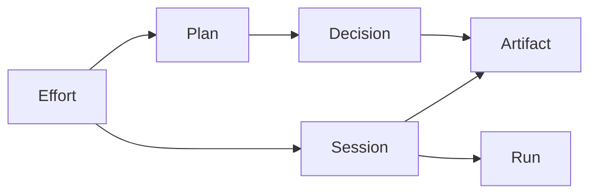

# Flatbread Agent Artifact Opportunity

Research and product perspective on relational agent artifacts stored in git, state of the art (2026), and Flatbread's wedge as it pivots beyond GraphQL-only query surfaces.

## 1. Executive Summary

The agent artifact layer in 2026 is dense with conventions and files (`AGENTS.md`, `SKILL.md`, `.handoff/*.md`, `.GCC/branches/*`, `.cs/discoveries.md`, vault MCPs) but thin on **typed relational schemas** over those artifacts. Teams get search, backlinks, versioned memory trees, and handoff packets; they rarely get reference integrity, stable cross-tool IDs, or filterable graph queries like "all blocking decisions for this effort with owning plan and producing sessions." Flatbread already models collections, refs, and rich filters over markdown/YAML in git. Positioning it as **the relational layer for agent efforts in git**—with MCP and generated TypeScript alongside GraphQL—is a credible category move. The recommended posture is an **Effort Graph**: a preset schema (Effort → Plan, Decision, Session, Artifact, Run) plus validation, append-oriented writes, and agent-facing query APIs, without building a CMS or competing on generic databases.

## 2. The Problem

Agent harnesses produce long outputs (plans, research dumps, code reviews, traces) but rarely persist them as **cohesive elements** bound to a named effort—feature, spike, migration, or research thread. The next phase of a pipeline often starts cold unless a human or script deliberately passes a markdown file into context.

Consequences:

- **Decision drift** — earlier conclusions are lost or contradicted across sessions.
- **Repeated discovery** — the same codebase areas get re-explained.
- **Weak accountability** — hard to answer "what did we decide about X for effort Y across all runs?"
- **Manifest scaling** — single-file hot memory (`AGENTS.md`, constitution files) works until it does not; real projects scale to tiered cold stores and specialist agents ([Codified Context](https://arxiv.org/html/2602.20478v1) reports on the order of tens of thousands of lines of machine-oriented specs for a ~108k LOC system).

The missing abstraction is not "more markdown" but a **stable, queryable object graph** whose instances live in the repo and survive tool switches.

## 3. State of the Art — Five Layers

Patterns cluster into five layers. None alone delivers typed relations + integrity over arbitrary harness layouts.

### Manifest layer

Single-file or small-set instructions loaded every session: `AGENTS.md`, `CLAUDE.md`, `.cursorrules`, Cursor rules with YAML frontmatter (`globs`, `alwaysApply`, `description`, path constraints). Empirical studies report adoption and content patterns across thousands of repos; one line of evidence associates **AGENTS.md** with roughly **29% lower median runtime** and **17% lower output token consumption** (as cited in [Codified Context](https://arxiv.org/html/2602.20478v1) related work). This layer optimizes **always-on priming**, not structured artifact graphs.

### Skill / package layer

Reusable procedures shipped as files (e.g. Claude Code [Skills](https://code.claude.com/docs/en/skills)), Cursor Agent Skills, packaged "agentic artifacts." [Agentic Beacon](https://github.com/Shadowsong27/agentic-beacon) frames a package-manager metaphor for contexts, knowledge, and skills across teams—addressing **context drift** analogously to code reuse. Strength: distribution and versioning of **playbooks**. Weakness: still not a relational model over instances (efforts, decisions, runs).

### Workspace / handoff layer

Deliberate disk layouts for continuity: [handoff](https://semiherdogan.medium.com/handoff-a-better-way-to-run-autonomous-development-loops-00e97e62d470)-style `.handoff/` trees (`FEATURE.md`, `SPEC.md`, `DESIGN.md`, `STATE.md`, `SESSION.md`); [AgentHandoff](https://github.com/aceandro2812/AgentHandoff) for switching between Claude Code, Codex, Cursor with structured packets and reported **60–85% token reduction** vs cold rediscovery; [long-running-harness](https://github.com/eddiearc/long-running-harness) patterns (`feature_list.json`, `progress.txt`); ecosystem demand for named persistent plans (e.g. Claude Code Plan Manager discussions). This layer fixes **handoff** between tools or phases; it does not standardize cross-effort querying or ref validation.

### Memory-as-VCS layer

Treat agent memory like version control. **Git Context Controller** ([GCC](https://arxiv.org/html/2508.00031v2)): `.GCC/main.md`, per-branch `commit.md`, `log.md`, `metadata.yaml`; commands `COMMIT`, `BRANCH`, `MERGE`, `CONTEXT` for layered retrieval; strong benchmark results (e.g. **80.2%** on SWE-Bench Verified with Claude 4 Sonnet in reported runs). **Lore** ([arXiv](https://arxiv.org/abs/2603.15566)) repurposes git commit trailers for structured decision shadows. **agmem** ([GitHub](https://github.com/vivek-tiwari-vt/agmem)): git-like, content-addressable agent memories. **claude-sessions** ([GitHub](https://github.com/hex/claude-sessions)): workspaces with discoveries, artifacts folders, checkpoints. These systems excel at **timelines, branches, and checkpoints**; they are weak on arbitrary typed edges (e.g. Decision → Plan → Effort) validated at index time.

### Knowledge-graph / vault layer

Markdown vaults + retrieval: **Codified Context** ([paper](https://arxiv.org/html/2602.20478v1))—constitution (hot), specialist agents, cold markdown specs + MCP keyword retrieval (`find_relevant_context`, `suggest_agent`), scaled to hundreds of sessions. **engraph**, **memory-graph**, **Obsidian**-oriented stacks combine wiki-links, embeddings, BM25/FTS. **MCP vault servers** (e.g. [markdown-vault-mcp](https://github.com/pvliesdonk/markdown-vault-mcp), [vault-mcp](https://github.com/Lincyaw/vault-mcp), [vault-semantic-mcp](https://github.com/eman-hc/vault-semantic-mcp), [knowledge-mcp](https://github.com/andrewbergsma/knowledge-mcp)) expose search, backlinks, sometimes hybrid semantic + lexical retrieval. Strength: **find related notes**. Weakness: links are typically untyped strings; "Tier 3 document lists" are not foreign keys.

### Adjacent: Markdown content tooling

[Velite](https://velite.js.org/), Keystatic, `next-mdx-remote`, and the legacy Contentlayer space optimize **sites and apps** from markdown collections. They overlap Flatbread on "typed-ish content in repos" but do not target **multi-session agent efforts** or harness-native conventions.

## 4. The Gap

Across manifest, skill, workspace, memory-as-VCS, and vault layers, convergent capabilities include:

- File and folder conventions.
- Full-text and semantic search.
- Versioned or branching narrative memory.
- Wiki-links and backlinks.

Conspicuously absent as a **first-class product**:

| Missing capability                             | Why it matters                                                                         |
| ---------------------------------------------- | -------------------------------------------------------------------------------------- |
| **Typed relational schemas** over artifacts    | Filters like `status`, `blocking`, `effort_id` need columns, not only embeddings.      |
| **Reference integrity**                        | Broken Plan → Decision links should fail at load/validate time, not at retrieval luck. |
| **Stable IDs**                                 | Renames and multi-branch workflows should not orphan edges.                            |
| **Canonical Effort (or equivalent) aggregate** | Same role PR plays for commits: one object that owns the thread.                       |
| **Non-text queries**                           | Traverse + filter + sort without grepping or re-ranking chunks.                        |

Example that is painful everywhere above but natural in a relational content layer: _"Decisions for Effort X where `blocking: true`, ordered by `decided_at`, with `plan.title` and `session.tool`."_

## 5. Why Flatbread Is Shaped For This

Flatbread's existing architecture maps cleanly onto the gap:

- **Collections and refs** — GraphQL schema generation from content collections and cross-collection references ([`packages/core/src/generators/schema.ts`](packages/core/src/generators/schema.ts)) matches Effort-linked entity graphs.
- **Structured filtering** — Mongo-style filter operators on collection fields ([root README](README.md) — `eq`, `in`, `exists`, `regex`, `wildcard`, etc.) exceed typical vault MCP keyword APIs for **predicate-rich** agent queries.
- **Markdown/YAML as rows** — [`packages/transformer-markdown`](packages/transformer-markdown), [`packages/transformer-yaml`](packages/transformer-yaml) align with how harnesses already emit artifacts.
- **Pluggable sources** — [`packages/source-filesystem`](packages/source-filesystem) can ingest `.agents/`, `.cursor/`, `.handoff/`, `.GCC/`, `.cs/` trees as additional content paths without a new storage paradigm.
- **Codegen path** — [`packages/codegen/src/generator.ts`](packages/codegen/src/generator.ts) is the right place to grow **generated TypeScript accessors** as the agent-ergonomic surface GraphQL is not.

The [PMF audit](flatbread-flow-pmf-audit.md) near-term list (config typing, ID normalization, relation validation, watch mode) is **the same prerequisite work** an agent-artifact product needs—not a competing roadmap.

## 6. Three Product Postures (Options)

### Posture A — Agent Artifact OS

Flatbread becomes a full memory product: authoring UI, lifecycle, branching UX, primary store for traces. **Target:** teams wanting one vendor for agent memory. **Surfaces:** dashboard, editors, sync. **Strength:** largest narrative TAM if execution wins. **Risk:** collides with IDE vendors and GCC-like research stacks; violates current PMF guidance to avoid hosted CMS/dashboard; requires broad writes and permissions Flatbread does not have today.

### Posture B — Relational Adapter for Agent Harnesses

Read-mostly preset: index existing harness folders, validate optional schemas, expose MCP + TS helpers. **Target:** harness engineers wiring Cursor/Claude/GCC without migrating storage. **Strength:** low displacement, fits today's read skew. **Risk:** commodity "nice indexer" unless paired with a sharp noun and integrity story.

### Posture C — Effort Graph (recommended)

Own the **Effort** aggregate explicitly: typed collections **Effort**, **Plan**, **Decision**, **Session**, **Artifact**, **Run** (and optional **Agent**, **Review**) with refs and validation; MCP + generated TS + GraphQL over one model; **append-oriented** agent writes into the graph. **Target:** multi-week agentic work in repos. **Strength:** differentiated category, testable MVP, uses every Flatbread primitive; clarifies the GraphQL pivot as "one of several query adapters." **Risk:** needs a minimal credible write path and a schema flexible enough for real harness diversity without dissolving into bespoke configs.

**Relational sketch (conceptual):**



## 7. Recommended Thesis

> **Flatbread is the relational layer for agent efforts in git.** Model efforts, plans, decisions, sessions, and artifacts as typed flat-file collections. Query them with **MCP**, **GraphQL**, or **generated TypeScript**. Catch broken references before the next session loses the thread.

**Why not A:** Avoids building a competing memory OS and UI; stays compositional with existing harnesses.

**Why not only B:** B is the implementation spine of C; C adds the **Effort** noun and integrity guarantees that make the positioning legible and defensible during a pivot away from GraphQL-only.

## 8. Reference Schema Sketch

Illustrative only—not a shipping API. Shows how collections and `refs` express the graph (paths and collection names are placeholders):

```js
import { defineConfig, transformerMarkdown, sourceFilesystem } from 'flatbread';

export default defineConfig({
  source: sourceFilesystem(),
  transformer: transformerMarkdown({ markdown: { gfm: true } }),
  content: [
    {
      path: '.flatbread-efforts/efforts',
      collection: 'Effort',
      refs: { owner_agent: 'Agent' },
    },
    {
      path: '.flatbread-efforts/plans',
      collection: 'Plan',
      refs: { effort: 'Effort' },
    },
    {
      path: '.flatbread-efforts/decisions',
      collection: 'Decision',
      refs: { effort: 'Effort', plan: 'Plan', session: 'Session' },
    },
    {
      path: '.flatbread-efforts/sessions',
      collection: 'Session',
      refs: { effort: 'Effort' },
    },
    {
      path: '.flatbread-efforts/artifacts',
      collection: 'Artifact',
      refs: {
        effort: 'Effort',
        session: 'Session',
        source_decision: 'Decision',
      },
    },
    {
      path: '.flatbread-efforts/runs',
      collection: 'Run',
      refs: { session: 'Session', effort: 'Effort' },
    },
    {
      path: '.flatbread-efforts/agents',
      collection: 'Agent',
    },
  ],
});
```

Frontmatter fields (e.g. `id`, `status`, `blocking`, `decided_at`, `tool`) would drive filters; body markdown holds narrative. This sketch **pressure-tests** PMF priorities: stable `id` semantics, duplicate detection, missing-ref diagnostics, and typed config for collections.

## 9. Surfaces To Ship

1. **MCP server** — tools: list collections, query with existing filter DSL, expand refs, fetch artifact body; primary **agent-tailored** surface for the GraphQL pivot.
2. **Generated TypeScript accessors** — typed queries aligned with codegen ([`packages/codegen`](packages/codegen)).
3. **GraphQL** — keep for humans, Studio, and apps already on Apollo.
4. **Append / deposit API** — narrow writes: create or append artifact rows with validation (no general transactional DB).
5. **Watch mode** — content reload without full process restart ([audit gap](flatbread-flow-pmf-audit.md) on local loop).
6. **Conventions preset** — optional mapping from common paths (`AGENTS.md`, `SKILL.md`, `.cursor/rules`, `.handoff/*`, `.GCC/branches/*`, `.cs/*`) into derived or linked collections without forcing migration day one.

## 10. Strategic Implications

- **Query surfaces:** GraphQL becomes explicitly **one adapter** over a single relational model; MCP and TS carry agent workflows.
- **Writes:** First-class but **scoped**—append-only artifact deposits + validation—not OLTP.
- **ICP shift:** From "relational markdown for sites" toward **"multi-session agentic efforts in repos"**—faster-moving buyer and clearer wedge than generic flat-file DB comparisons (per audit).
- **Roadmap elevation:** ID normalization, relation validation, and watch mode rise from hygiene to **product blockers** for this use case.

## 11. Tensions With The PMF Audit

Cross-check against [What Not To Build Yet](flatbread-flow-pmf-audit.md) and related warnings.

| Audit constraint                                                                                   | Relationship to Posture C (Effort Graph)                                                                                                                                         |
| -------------------------------------------------------------------------------------------------- | -------------------------------------------------------------------------------------------------------------------------------------------------------------------------------- |
| Do not build hosted CMS, dashboard, or editing UI yet                                              | **Respects.** MCP/CLI/codegen only; no mandated admin UI.                                                                                                                        |
| Do not compete with full databases on transactions, auth, permissions, high-scale writes           | **Respects** if writes stay append-oriented, local, and validation-focused; **stretches** if users demand multi-user locking or roles—then explicitly out of scope.              |
| Do not over-invest in many source plugins before local filesystem relational workflow is excellent | **Respects** if Effort Graph ships as one filesystem preset + optional path mappings; **stretches** if many SaaS sources are added prematurely—avoid.                            |
| Do not keep GraphQL as the only story                                                              | **Aligns.** MCP + TS are first-class in this thesis.                                                                                                                             |
| Do not add complex migration systems before schemas, IDs, validation, exports, watch               | **Aligns.** Effort Graph assumes those foundations land first; **reopens** migration only as import from handoff/GCC folders once core is stable.                                |
| Avoid database replacement framing until write path exists                                         | **Stretches language**—"relational layer" must stay precise: **not** a serverless Postgres; **reopens** the need for a documented, minimal write story before marketing breadth. |

Section **8** (schema sketch) and **9** (surfaces) should stay synchronized with audit honesty: no promise of generic mutations until shipped.

## 12. Validation Experiments

Before roadmap commitment:

1. **Preset wire-up** — Point Flatbread at an existing agent folder in a real repo (e.g. `.agents/` or documented handoff layout). Can one MCP query return _all blocking decisions for the current effort with plan title_ without custom scripts?
2. **Adversarial schema** — One Effort Graph schema against three layouts: Claude Code-oriented tree, Cursor rules + skills layout, GCC `.GCC/` layout. Where does a single schema break? What mapping layer is minimal?
3. **Token budget** — Compare cold-start context stuffing vs Flatbread-mediated retrieval over a multi-session effort; benchmark against published handoff savings orders (e.g. AgentHandoff's reported range) as a directional bar, not a guarantee.

## 13. What Not To Build Yet

- Hosted editing UI or CMS.
- Mandatory vector index inside core (optional plugin later).
- Arbitrary update/delete mutation API on arbitrary fields.
- New source plugins for proprietary SaaS artifact stores before filesystem Effort Graph is excellent.
- Replacing Claude Code, Cursor, or Codex harnesses—Flatbread should **compose**, not compete.

## 14. Bottom Line

**Thesis:** Flatbread should own **typed, validated, queryable effort graphs in git**, exposed to agents primarily via **MCP and generated TypeScript**, with GraphQL as a parallel adapter. **Next step:** run the three validation experiments in §12; let results set the minimum mapping layer and write-scope for v1 of the preset.

---

## References (selected)

- Wu et al., [Git Context Controller](https://arxiv.org/html/2508.00031v2) (GCC).
- Vasilopoulos, [Codified Context: Infrastructure for AI Agents in a Complex Codebase](https://arxiv.org/html/2602.20478v1).
- Lore: [Repurposing Git Commit Messages as a Structured Knowledge Protocol](https://arxiv.org/abs/2603.15566) (arXiv).
- Claude Code [Skills documentation](https://code.claude.com/docs/en/skills).
- [AgentHandoff](https://github.com/aceandro2812/AgentHandoff), [claude-sessions](https://github.com/hex/claude-sessions), [agmem](https://github.com/vivek-tiwari-vt/agmem), [Agentic Beacon](https://github.com/Shadowsong27/agentic-beacon).
- Vault / knowledge MCP examples: [markdown-vault-mcp](https://github.com/pvliesdonk/markdown-vault-mcp), [engraph](https://github.com/devwhodevs/engraph).
