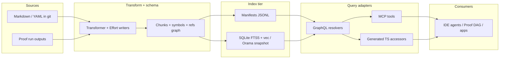

# Flatbread Search and Memory Research

A weighing of opportunities, hypotheses of outcome, and an ideal end state for the Flatbread + Proof axis as a search-and-memory substrate.

> Companion to [`flatbread-agent-artifact-opportunity.md`](flatbread-agent-artifact-opportunity.md) and [`flatbread-flow-pmf-audit.md`](flatbread-flow-pmf-audit.md). Synthesizes upstream dossiers under `/tmp/proof-search/` (`audit-flatbread-retrieval.md`, `audit-proof-context.md`, `sota-dense-sparse-hybrid.md`, `sota-graph-structure.md`, `sota-agent-memory.md`, `sota-embeddable-runtimes.md`, `synthesis-flatbread.md`, `synthesis-proof.md`, `synthesis-novel.md`).

---

## 1. Executive Summary

The 2026 retrieval frontier has converged on a small set of patterns — structure-aware AST chunking, hybrid dense + sparse retrieval with reciprocal-rank fusion, small Apache-2.0 cross-encoder rerankers, hierarchical (RAPTOR) and graph-aware (GraphRAG / LightRAG / PathRAG) retrieval, Anthropic-style contextual prefixing, and bi-temporal git-native memory. Every one of those patterns spends most of its index budget paying an LLM to extract entities and edges from prose, and every one of them treats the index as a binary blob outside the user's repo. **Flatbread + Proof can occupy a category nobody else can: a typed relational substrate where the user's markdown already carries the gold-label graph (`refs`, wikilinks, headings, folders) and the agent's DAG run already carries another (depends_on, ranks, convergence loops), fused through one schema, queried through GraphQL / MCP / generated TypeScript, with a deterministic git-friendly index.** The thesis of this report is that the search and memory work is not a side quest from the Effort Graph thesis of [`flatbread-agent-artifact-opportunity.md`](flatbread-agent-artifact-opportunity.md) — it is the same substrate, viewed from two ends: humans browsing related content on one side, agents recalling and writing efforts on the other. The recommended trajectory is **Posture B (Effort-Graph + Hybrid Retrieval)**, sequenced so the relational primitives the PMF audit already prioritizes (config typing, ID normalization, validation, watch mode) land first and unlock everything else as natural extensions.

**Five headlines:**

- **Markdown's structure is already gold-label graph data**, and treating it as such collapses ~70% of GraphRAG's index cost (`sota-graph-structure.md` §10.5, §14.1; `synthesis-novel.md` N1). The expensive thing the field pays for at index time has, for Flatbread users, already been paid by the author.
- **Hybrid retrieval (BM25 + dense + RRF) plus a small Apache-2.0 reranker is now table stakes**, runnable in pure TypeScript with no daemon (Qwen3-Embedding-0.6B + `bge-reranker-v2-m3` over SQLite + `sqlite-vec` + FTS5 — `sota-dense-sparse-hybrid.md` §8 Tier-1; `sota-embeddable-runtimes.md` §Shortlist). Shipping it sets a license-clean default the entire 12-opportunity catalogue can reuse.
- **The single most acute bug in Proof today is the `UPSTREAM_SNIPPET_CAP=2000` truncation** in [`packages/proof/src/run_dag.ts`](packages/proof/src/run_dag.ts) (`audit-proof-context.md` §1.2–1.3). Replacing the hand-coded `SECTION_DROP_PRIORITY` with content-aware reranking is a small, local edit and the most-cited dossier-wide quality lever (`synthesis-proof.md` O3).
- **An MCP surface (`semantic_search`, `related_to`, `expand_neighborhood`, `summarize_collection`) is the cheapest way to break Flatbread's GraphQL-only positioning** (`flatbread-flow-pmf-audit.md` §1; `synthesis-flatbread.md` F10) without shipping a CMS. It is also the only realistic substrate for Proof (and Cursor / Claude Code / Codex) to share memory.
- **The defensibly novel bet** is to recognize that _both_ the user's repo and the agent's DAG are already graphs and to fuse them as a single typed schema, with the index as deterministic JSONL committed alongside the markdown when teams want it (`synthesis-novel.md` Industry Bet I — "Git Mind"). No incumbent — Letta Context Repositories, Cursor Memories, Mem0, Zep, Microsoft GraphRAG — combines git substrate, DAG-node memory units, relational query, and tool-portable projection in one product.

---

## 2. The Problem

Flatbread's relational filter DSL is excellent on **declared frontmatter columns and configured `refs`**, and it is structurally blind to **everything inside the markdown body** — heading structure, wikilinks, code fences, callouts, embedding-space neighbors, graph neighborhoods past the explicit `refs`. Proof's parent → child context passing is excellent on **`depends_on` edges**, and is structurally blind to **everything else** — siblings in the same rank, grandparents reached through edges, prior runs, the host repository the agents are _editing_. Both halves of the system fail in the same shape: when the user asks a question whose answer is _in the corpus_ but isn't _in a column_, the system has no recourse. Frontmatter-only retrieval and parent-text-truncation are two faces of the same blindness.

### 2.1 Frontmatter-only retrieval is structurally insufficient

The audit ([`/tmp/proof-search/audit-flatbread-retrieval.md`](file:///tmp/proof-search/audit-flatbread-retrieval.md) §2.4–2.5, §3.1, §5) is unambiguous about today's retrieval surface in [`packages/core`](packages/core):

- The `filter` JSON DSL (`packages/core/src/utils/sift.ts`) is a Mongo-style comparator engine: `eq`, `ne`, `lt/lte/gt/gte`, `in/nin`, `includes/excludes`, `regex`, `wildcard`, `exists`, `strictlyExists`. It runs over an **in-memory `EntryNode` JSON graph**, with `resolveFilter` (`packages/core/src/resolvers/arguments.ts`) executing an internal GraphQL subquery to fetch only the leaf paths a filter mentions, then `sift()`-ing the result.
- Boolean composition is **implicit AND** across flattened leaf conditions (`reduceBooleans('and')` in `packages/core/src/utils/sift.ts`); `$or` and `$nor` are unimplemented in the default sift path even though `reduceBooleans` supports `or` internally. `findMany(ids)` lacks the `filter` argument that `all*` has. `sortBy` only resolves top-level keys (`packages/core/src/resolvers/arguments.ts:162-176`).
- The `transformer-markdown` pipeline ([`packages/transformer-markdown`](packages/transformer-markdown)) emits `_filename`, `_path`, `_slug`, `_content.raw`, and lazy `_content.html` / `_content.excerpt` / `_content.timeToRead`. It does **not** emit a heading hierarchy, wikilinks, code-fence metadata, callouts, or any other AST-derived structural fields. There is no chunking; the entire body is a single string scalar.
- There is no lexical index, no embedding, no reranker, no graph traversal beyond the explicit `refs` wired through `addRelation` in `packages/core/src/generators/schema.ts`.

The downstream consequences are exactly the ones the dossiers diagnose:

- **Author-visible body content is invisible to retrieval.** A user can ask "find docs whose outline mentions Postgres tuning" only by writing a `regex` filter against `_content.raw`, which (a) is a brittle string match, (b) routinely runs against _megabyte_ strings because `cloneDeep`-of-collection is a per-resolver pattern (`audit-flatbread-retrieval.md` §9 Q7), and (c) cannot be safely sent from a JSON HTTP client because `sift.regex` expects a live `RegExp` (`packages/core/src/utils/sift.ts:75-76`).
- **Wikilinks are dead text.** The Obsidian vault's signature graph — the linked-mention `[[Note]]` edge — has zero presence in Flatbread's GraphQL schema. The `refs` mechanism only honors fields the user wired in their config; the body's bidirectional graph is uncaptured (`audit-flatbread-retrieval.md` §3.1).
- **"Related content" defaults to tag collisions.** Without embeddings and without body-derived edges, the only "related" signal a Flatbread-backed site has is shared frontmatter values. For garden-style wikis and prose-heavy blogs that is a near-total miss; for tag-disciplined developer documentation it works for the tag's intent and nothing else.
- **Agents cannot ask "what is in here?" without grepping**. Cursor's published numbers report **+12.5% accuracy** when semantic search supplements grep on 1,000+-file repos (`sota-agent-memory.md` §2.8); Anthropic Contextual Retrieval reduces top-20 retrieval failures by **35–67%** (`sota-dense-sparse-hybrid.md` §6). Flatbread today provides neither, so any agent tool that wants to ground in markdown rediscovers the corpus on each invocation.

The PMF audit treats this as a near-term hygiene matter ([`flatbread-flow-pmf-audit.md`](flatbread-flow-pmf-audit.md) §1 GraphQL-as-product, §3 missing writes, §4 missing constraints, §5 watch mode). The retrieval gap is more than hygiene: when a competing product can answer "find blocking decisions for effort X about retry semantics" with one query, Flatbread's frontmatter-only filter looks like a half-finished prototype regardless of how clean its relational primitives are.

### 2.2 Parent-text truncation is the same bug, on the agent side

Proof's audit ([`/tmp/proof-search/audit-proof-context.md`](file:///tmp/proof-search/audit-proof-context.md) §1.1–1.5, §2, §8, §10) names the analogous problem in [`packages/proof/src`](packages/proof/src):

- Each LLM task's `assistant` stream is appended to a `BoundedTextBuffer` capped at `STREAM_CAP = 4000` chars (`packages/proof/src/run_dag.ts:1124-1135`). The `resultText` field that downstream tasks see is the buffer's render — early prose is dropped with a truncation banner.
- When a child task assembles its prompt, `buildUpstreamContext` (`packages/proof/src/run_dag.ts:1606-1628`) loops over each `depends_on` parent and includes **at most `UPSTREAM_SNIPPET_CAP = 2000` chars per parent** through `truncateUpstreamSnippet`. The truncator is _section-aware_ — it splits on `## Headings` and drops sections in a fixed `SECTION_DROP_PRIORITY` order (`Current contract` → `Validation plan` → `Human checkpoints` → `Migration impact` → `Proposed contract`) — but the priority list is **hand-coded for one task shape** and has zero awareness of _what the child actually wants to know_. When the priority list runs out, it falls back to a hard slice.
- There is **no embedding, reranker, episodic store, cross-rank retrieval, or repo-aware retrieval** anywhere in the runner. The only structured artifacts are the `--findings-dir` sidecars (themselves a cache of the same capped `resultText`) and the optional `--full-output-dir` uncapped dumps that downstream tasks never read. Across runs there is no episodic memory unless the operator wires `--state-path` and reuses it by hand.

The audit's named pain points map onto the same retrieval failures the markdown side suffers from (`audit-proof-context.md` §10):

1. **Duplicated discovery** — siblings in the same rank cannot see each other's partial conclusions because `Promise.all` makes them concurrent and `buildUpstreamContext` only reads `depends_on`. Three subagents independently grep the same files.
2. **Contradictory downstream merges** — a merge task only receives capped snippets from immediate parents; conflicting rationales from earlier ranks are truncated away.
3. **Lost rationale** — `STREAM_CAP` + `UPSTREAM_SNIPPET_CAP` drop reasoning steps; children inherit conclusions without the _why_.
4. **Stale or empty failure context** — failed parents surface `(failed: …)` only; no automatic richer error telemetry in prompts.
5. **Reviewer blind spots** — convergence reads specific headings (`Blockers`, `High-severity findings`); unstructured insights elsewhere never trigger `--converge-on` loops.

### 2.3 Why the two are the same problem

The shared diagnosis is not "retrieval is missing" — Flatbread has a query layer; Proof has prompt stitching — it is that **both sides treat the corpus as opaque text past a fixed boundary** (the frontmatter, the snippet cap) and have no protocol for asking "which slice of the body is relevant _to this question_?" The answer that the rest of the field has converged on is some combination of structure-aware chunking + hybrid retrieval + reranking + graph expansion + (optionally) hierarchical summary trees. The unique observation for the Flatbread + Proof axis is that **the structure that drives chunking and the graph that drives expansion already exist in the source — they just aren't materialized as queryable columns yet** (`synthesis-novel.md` §0; `sota-graph-structure.md` §14.1). Once they are, the same primitive serves "related posts on a docs site" and "what did we decide about idempotency in the previous Proof run" with one schema and one query language.

---

## 3. State of the Art

The 2024–2026 retrieval/memory literature consolidates into four families with distinct primitives: (a) **dense / sparse / hybrid retrieval over chunks** with cross-encoder rerankers; (b) **structural and graph-based retrieval** that exploits document hierarchy and explicit edges; (c) **agent memory** systems with extract / consolidate / forget loops; and (d) **embeddable runtimes** that determine what can actually ship inside a TypeScript-first product. Below is the condensed taxonomy with one comparison table per family. Numbers are quoted only when the upstream dossiers cite them; license callouts matter because Flatbread defaults must avoid CC-BY-NC weights (`sota-dense-sparse-hybrid.md` §8 Tier-3).

### 3.1 Dense, sparse, and hybrid retrieval

The dossier `sota-dense-sparse-hybrid.md` is the canonical reference and the source of every number below.

The single-vector embedding world fragmented sharply between mid-2024 and late 2025. Three forces reshaped the leaderboard: LLM-backbone embedders (Mistral-7B, Qwen2/3, Gemma3) push MTEB averages above 70; **Matryoshka Representation Learning** lets the same vector serve at 256 / 512 / 1024 / 2048 dims; instruction-tuned and MoE variants narrow the gap between 0.5B and 7B models. Late-interaction (ColBERT-class) keeps one vector per token and scores via MaxSim, beating single-vector cosine on long-tail queries at 30–100× storage cost. Learned-sparse models (SPLADE family, Qdrant's BM42, BGE-M3's sparse output) bring transformer-derived term weights into classical inverted indexes. **Hybrid lexical + dense beats either alone on BEIR by 3–8 nDCG@10** (`sota-dense-sparse-hybrid.md` §4); **Reciprocal Rank Fusion (RRF) with `k=60` is the default of every major engine** (Azure AI Search, Elasticsearch, Weaviate, Qdrant). Cross-encoder rerankers are the largest single quality lever after retrieval — Anthropic's Contextual Retrieval reports a reranker reduces top-20 retrieval failure by an additional **~32 points** on top of contextual BM25 + embeddings (`sota-dense-sparse-hybrid.md` §5).

Chunking is where most retrieval failures _originate_. The 2024 wave gave us four high-leverage strategies: **structure-aware markdown** chunking via `mdast` AST (the unsung hero for any markdown corpus); **late chunking** (Jina, Sep 2024 — embed the whole doc with a long-context model, then mean-pool over chunk-shaped slices, +5–10% nDCG@10 on chunk-needle tasks); **Anthropic Contextual Retrieval** (prepend a 50–100-token LLM-generated locator before embedding; **−35% top-20 retrieval failures, −49% with reranking, −67% with reranking + BM25**); and **propositional / Dense X** chunking (rewrite paragraphs into atomic propositions; +9 Recall@5). The cleanest pre-retrieval tricks are **HyDE** (hypothetical-document embeddings, +4.2% nDCG@10 in the Rocchio-weighted variant), **multi-query / RAG-Fusion** (paraphrase, retrieve, RRF), **step-back prompting**, and **query routing** (classify into `{factoid, prose, code, multi-hop, nav}` and dispatch to the specialist retriever).

#### Comparison table — dense / sparse / hybrid components

| Category                  | Pick                                                        | License             | JS/TS feasible?                     | Headline number                                                                     | Source                           |
| ------------------------- | ----------------------------------------------------------- | ------------------- | ----------------------------------- | ----------------------------------------------------------------------------------- | -------------------------------- |
| Dense embedder, on-device | **Qwen3-Embedding-0.6B** (1024-dim, 32k ctx, MRL)           | Apache 2.0          | Yes — `transformers.js` v3 + WebGPU | MTEB multilingual avg ~64.3, beats BGE-M3 at fraction of size                       | `sota-dense-sparse-hybrid.md` §1 |
| Dense embedder, server    | **Voyage-3-large** API                                      | Commercial          | API only                            | MTEB ≈ 68.2; binary 512-dim ~200× storage win                                       | `sota-dense-sparse-hybrid.md` §1 |
| Three-modes-one-pass      | **BGE-M3** (568M, 1024-dim, 8192 ctx)                       | MIT                 | Yes — `fastembed-js`                | One forward pass = dense + sparse + ColBERT vectors; BEIR ~48.8 dense, ~51.8 hybrid | `sota-dense-sparse-hybrid.md` §1 |
| Sparse / lexical floor    | **BM25 over `tsvector`** / **SQLite FTS5**                  | Public domain / OSS | Yes                                 | Zero new infra; ships in the DB                                                     | `sota-dense-sparse-hybrid.md` §3 |
| Learned sparse pragmatic  | **BM42** (90 MB transformer attentions)                     | Apache 2.0          | Yes — `onnxruntime-node`            | "Experimental"; sometimes loses to plain BM25 with good tokenizer                   | `sota-dense-sparse-hybrid.md` §3 |
| Hybrid fusion default     | **RRF k=60** in SQL                                         | n/a                 | Pure SQL CTE                        | Score-agnostic; same default as every major engine                                  | `sota-dense-sparse-hybrid.md` §4 |
| Reranker default          | **`bge-reranker-v2-m3`** (278M ONNX)                        | Apache 2.0          | Yes — `onnxruntime-node`            | BEIR ~51.8; 30–100 ms per 20 candidates                                             | `sota-dense-sparse-hybrid.md` §5 |
| Reranker premium          | **`mxbai-rerank-base-v2`** (0.5B ONNX)                      | Apache 2.0          | Yes                                 | BEIR ~55; +3–5 nDCG over bge-v2-m3                                                  | `sota-dense-sparse-hybrid.md` §5 |
| Reranker hosted           | **Voyage rerank-2.5-lite** (instruction-following, 32k ctx) | Commercial          | API only                            | +7.16% over Cohere Rerank v3.5; $0.020/1M tok                                       | `sota-dense-sparse-hybrid.md` §5 |
| Chunking default          | **Structure-aware mdast** (`remark` + `chunkdown`)          | MIT                 | Yes — JS-native                     | Markdown's own structure is the best signal                                         | `sota-dense-sparse-hybrid.md` §6 |
| Index-time augmentation   | **Anthropic Contextual Retrieval** (prefix + prompt cache)  | n/a (recipe)        | Yes — any LLM                       | −35 / −49 / −67% retrieval failures (with reranker / +BM25)                         | `sota-dense-sparse-hybrid.md` §6 |
| Late interaction (opt-in) | **`mxbai-edge-colbert-v0-17m`** in `fast-plaid-web` (WASM)  | Apache 2.0          | Yes — WASM                          | 17M-param ColBERT; ~6.2 MB index, sub-second cold load                              | `sota-dense-sparse-hybrid.md` §2 |

Avoid in defaults: **NV-Embed-v2** (CC-BY-NC), **SPLADE-v3** (CC-BY-NC-SA), **Jina Reranker v2 weights** (CC-BY-NC) (`sota-dense-sparse-hybrid.md` §8 Tier-3).

### 3.2 Structural and graph retrieval

The `sota-graph-structure.md` dossier organizes the field into three complementary families (`sota-graph-structure.md` §0):

1. **Hierarchical summarization** — RAPTOR-style recursive trees that give the LLM a _zoomable_ abstraction ladder rather than a flat list of leaves.
2. **LLM-extracted entity / relation graphs** — Microsoft GraphRAG, LightRAG, HiRAG, Fast GraphRAG, PathRAG. They materialize a graph from prose, then partition (Leiden community detection) or prune (relational paths) at query time.
3. **Adaptive / self-reflective retrieval** — Self-RAG, Corrective RAG (CRAG), Tree-of-Clarifications. Retrieval becomes a _decision_ the model makes per segment, with reflection tokens or evaluator heads gating the loop.

The high-leverage observation, repeated across the dossier, is that **the expensive step in every graph-RAG paper — "use an LLM to extract entities and edges from prose" — has already been done by the markdown author when they wrote frontmatter `refs`, `[[wikilinks]]`, headings, and folder structure** (`sota-graph-structure.md` §0, §10.5, §14.1). The $50–$200 / 1M-tokens index cost dominated by `extract_graph` and `create_community_reports` in Microsoft GraphRAG (`sota-graph-structure.md` §3) is recoverable for _zero_ on a vault that already declares its graph; LLM extraction need only fill in the _prose-only residue_. PathRAG over the existing graph operates at **no extra index cost** and outperforms GraphRAG / LightRAG / NaiveRAG on six datasets × five metrics (comprehensiveness, diversity, logicality, relevance, coherence), with the biggest deltas on logicality and coherence — exactly what one expects from path-form prompting vs neighbor-soup prompting (`sota-graph-structure.md` §6).

#### Comparison table — graph and structural retrieval

| Method                                                     | Index cost                                | Update story               | Reported delta vs flat RAG                                             | License    | JS/TS path                       |
| ---------------------------------------------------------- | ----------------------------------------- | -------------------------- | ---------------------------------------------------------------------- | ---------- | -------------------------------- |
| **RAPTOR**                                                 | Medium (recursive LLM summarization)      | Rebuild on append          | +20% absolute on QuALITY (GPT-4); strong on NarrativeQA, QASPER        | MIT        | Easy port (~400 LoC)             |
| **Microsoft GraphRAG**                                     | High (LLM extraction + community reports) | Batch                      | Dominates flat RAG on global summarization; +25 pts on 2WikiMultiHopQA | MIT        | GraphRAG.js (community)          |
| **LightRAG**                                               | Medium                                    | **Incremental**            | 60–85% win-rate on QFS; weaker than GraphRAG on multi-hop              | MIT        | `@graphrag-js/light`             |
| **HiRAG**                                                  | Medium-high                               | Batch                      | +2–8 pts over GraphRAG/LightRAG/RAPTOR                                 | MIT        | Small port                       |
| **Fast GraphRAG**                                          | **Low** (6× cheaper than MS)              | Incremental                | 27× faster, 40% more accurate vs MS GraphRAG (per repo bench)          | MIT        | `@graphrag-js/fast`              |
| **PathRAG**                                                | Low (no extra index cost)                 | Same as base               | Beats GraphRAG/LightRAG on 6 datasets × 5 metrics                      | research   | Small port (~500 LoC)            |
| **GNN-RAG**                                                | High (GNN training)                       | Batch                      | +8.9–15.5 F1 on multi-hop KGQA (WebQSP/CWQ)                            | research   | Python sidecar                   |
| **Tree-of-Clarifications**                                 | Per-query LLM cost                        | n/a                        | SOTA on ASQA Disambig-F1/ROUGE                                         | research   | Trivial port                     |
| **Self-RAG**                                               | Training cost                             | n/a                        | Beats ChatGPT + RA Llama-2-Chat on QA / fact-verify / long-form        | MIT        | Reflection-token loop is generic |
| **CRAG**                                                   | T5 evaluator                              | n/a                        | Significant on PopQA/Bio/PubQA/ARC                                     | research   | T5 head + decompose-recompose    |
| **Cognee**                                                 | Medium (LLM cognify)                      | Incremental                | Up to 92.5% internal retrieval                                         | Apache 2.0 | Python only                      |
| **Obsidian MCPs** (engraph, vault-search, knowledge-graph) | Low (no LLM extraction)                   | Incremental (file watcher) | n/a (different evaluation)                                             | Mostly MIT | TS-native                        |

The Obsidian MCP cluster (`sota-graph-structure.md` §9) is the closest existing pattern to what Flatbread wants to ship: **hybrid retrieval (BM25 + embeddings + RRF), graph expansion (BFS over wikilinks ± backlinks ± tags), optional cross-encoder rerank, local-first**. Replace `[[wikilink]]` resolution with Flatbread's `refs` resolution and you have a working substrate.

A systematic re-evaluation of the GraphRAG family ([Han et al., arXiv:2502.11371](https://arxiv.org/abs/2502.11371)) is worth quoting honestly: **GraphRAG underperforms vanilla RAG on many real-world single-hop tasks**. The win is concentrated on multi-hop and global-summarization queries. The corollary for Flatbread: ship hybrid retrieval as the default; layer graph expansion / RAPTOR / community reports as opt-in for the workloads they actually win on.

### 3.3 Agent memory

The `sota-agent-memory.md` dossier organizes 13 systems along three axes (`sota-agent-memory.md` §1.1–1.3):

- **By cognitive role** — episodic (events with timestamps), semantic (durable facts), procedural (how-to recipes), working (current context).
- **By representation** — token-level / contextual (markdown / JSON files), vector / latent (embeddings), graph / structured (entity-relationship triples or KG nodes), parametric (fine-tuned weights, out of scope).
- **By management lifecycle** — _construction_ (extract, summarize, embed) → _update_ (`ADD/UPDATE/DELETE/NOOP`, evolution, supersession, commit) → _query_ (semantic, graph, time-window, importance) → _forgetting_ (Ebbinghaus decay, recency penalties, age-weighted pruning, bi-temporal supersession).

The same dossier separates **general agent-memory frameworks** (MemGPT/Letta, A-MEM, Mem0, Zep/Graphiti, LangMem, OpenAI/Anthropic platform memory, Cognee, MemoryOS, Generative Agents, Reflexion, SAGE, Selfmem) from **coding-harness retrieval** (Cursor's embedding + symbol-graph index, Claude Code's `CLAUDE.md` + auto-memory + Skills, Codex's `AGENTS.md` chain, Aider's tree-sitter repo-map with PageRank, OpenHands's keyword-triggered microagents, Cline's Plan/Act + Memory Bank). The bridge between them is a young cluster of **git-native memory papers** — Codified Context, Git Context Controller (GCC), Lore, agmem, Letta Context Repositories — that take the position the git repository should _be_ the memory database.

#### Comparison table — agent-memory systems

| System                                    | Core abstraction                                           | Storage                                           | Best benchmark                                                                                                     | License                                 | TS deployability                    | DAG fit                                                  |
| ----------------------------------------- | ---------------------------------------------------------- | ------------------------------------------------- | ------------------------------------------------------------------------------------------------------------------ | --------------------------------------- | ----------------------------------- | -------------------------------------------------------- |
| **MemGPT / Letta**                        | Tiered "OS" memory blocks; (2026) git-backed Context Repos | Postgres + filesystem; git worktrees per subagent | DMR 93.4%                                                                                                          | Apache 2.0                              | First-class TS SDK + Docker         | Strong — shared blocks + worktree merging                |
| **A-MEM**                                 | Zettelkasten notes with auto-linking & evolution           | ChromaDB (ref); pluggable                         | NeurIPS 2025 — beats RAG/MemGPT/Mem0 on 6 models                                                                   | Reference: non-commercial; TS port: MIT | Python first; community TS port     | Medium                                                   |
| **Mem0**                                  | Two-phase extract/update with `ADD/UPDATE/DELETE/NOOP`     | Vector (Qdrant/pgvector) ± graph (Neo4j)          | LoCoMo 66.9%, +26% over OpenAI Memory; 91% lower p95                                                               | Apache 2.0                              | First-class `npm i mem0ai`          | Weak — namespaces only; no branching                     |
| **Zep / Graphiti**                        | Bi-temporal knowledge graph                                | Neo4j / FalkorDB                                  | LongMemEval +18.5%; DMR 94.8%                                                                                      | Apache 2.0                              | Python core; community TS SDK       | Medium                                                   |
| **LangMem + LangGraph Store**             | Semantic / episodic / procedural over `BaseStore`          | Postgres / SQLite / in-mem                        | n/a (framework)                                                                                                    | MIT                                     | Python primary; LangGraph.js for TS | **Strong on DAG** — Checkpointer = branching/time-travel |
| **OpenAI Memory**                         | Curated user-fact text + chat-summary                      | Proprietary                                       | LoCoMo 52.9%                                                                                                       | Closed                                  | Consumer feature                    | None                                                     |
| **Anthropic Memory Tool + Skills**        | File-based memory + progressive-disclosure procedural      | Developer-owned                                   | n/a                                                                                                                | Tool: API; Skills spec: open            | First-class via Claude API          | Medium                                                   |
| **Cursor Rules + Memories**               | Markdown rules + per-project memory                        | Local + Turbopuffer index                         | +12.5% over grep on internal codebase QA                                                                           | Closed                                  | n/a (IDE feature)                   | None                                                     |
| **Cline Memory Bank**                     | Six-file markdown convention                               | Local files in `memory-bank/`                     | n/a                                                                                                                | MIT                                     | TS extension                        | Weak                                                     |
| **Cognee**                                | KG + vector hybrid with ontology                           | Postgres / Neo4j / Chroma                         | 92.5% internal retrieval                                                                                           | Apache 2.0                              | Python core; MIT TS Vercel SDK      | Medium                                                   |
| **MemoryOS**                              | OS-tiered short / mid / long memory                        | Reference impl                                    | LoCoMo F1 +49.11% on GPT-4o-mini                                                                                   | Open (academic)                         | None                                | Weak                                                     |
| **Generative Agents**                     | Memory stream + reflection                                 | Reference impl                                    | (qualitative; Smallville sim)                                                                                      | Open                                    | None                                | Weak                                                     |
| **Reflexion**                             | Episodic reflection buffer                                 | Reference impl                                    | HumanEval pass@1 91%                                                                                               | MIT                                     | Python                              | n/a                                                      |
| **Git Context Controller (GCC)**          | COMMIT / BRANCH / MERGE / CONTEXT git-shaped primitives    | `.GCC/` directory + git                           | **>80% SWE-Bench Verified** (+13% over long-context); 48% SWE-Bench Lite; self-replication 40.7% vs 11.7% baseline | open                                    | Python                              | **High by design**                                       |
| **Lore**                                  | Commit-trailer memory                                      | git only (no infra)                               | n/a                                                                                                                | open                                    | TS CLI                              | Strong                                                   |
| **Letta Context Repositories (Feb 2026)** | Memory as git repo; git worktrees per subagent             | git + Letta                                       | n/a (industrial validation)                                                                                        | Apache 2.0                              | TS SDK                              | High                                                     |

Two benchmarks are worth treating with care. **LoCoMo** (Mem0's home turf) shows Mem0 at 66.9% vs OpenAI Memory at 52.9%; Zep's published rebuttal ([Zep blog "Lies, Damn Lies, Statistics"](https://blog.getzep.com/lies-damn-lies-statistics-is-mem0-really-sota-in-agent-memory/)) shows Zep at **63.8–71.2%** on **LongMemEval** (GPT-4o) vs Mem0 at 49.0%, and Mem0 has not published official LongMemEval numbers (`sota-agent-memory.md` §2.3 caveat, §6.1–6.2). Treat single-benchmark dominance claims with skepticism. The honest baseline reading: **hybrid memory beats long-context baselines by ~10–18 pp at 90% lower latency and ~90% token savings** in any well-tuned setup; specific framework deltas are within noise of each other on the public benchmarks the field actually shares.

### 3.4 Embeddable runtimes (what can ship today)

The `sota-embeddable-runtimes.md` dossier inventories every git-native, zero-infra-by-default retrieval stack suitable for shipping inside a Node.js / TypeScript developer tool. The taxonomy is split between **vector stores** (sqlite-vec, sqlite-vss, libSQL, PGlite + pgvector, LanceDB, Vectra, Orama, hnswlib-node, USearch, Faiss-node, Qdrant, Weaviate embedded, Chroma, Milvus Lite), **lexical engines** (Tantivy, lunr, MiniSearch, FlexSearch, Tinysearch, Pagefind, SQLite FTS5), and **embedding / reranker inference** (`@huggingface/transformers`, `fastembed-js`, `onnxruntime-node`, `node-llama-cpp`, Ollama).

#### Comparison table — embeddable runtimes

| System                                            | Language / runtime | TS bindings                                       | On-disk format                         | Hybrid (in-process)                                | License                     | Git posture for `/.flatbread/index`               |
| ------------------------------------------------- | ------------------ | ------------------------------------------------- | -------------------------------------- | -------------------------------------------------- | --------------------------- | ------------------------------------------------- |
| **Orama**                                         | Pure JS            | First-class `@orama/orama`                        | In-mem; JSON / MessagePack persistence | **Yes — native BM25 + vector + RRF**               | Apache 2.0                  | OK as JSON for tiny; gitignore at scale           |
| **SQLite + sqlite-vec + FTS5**                    | C SQLite extension | `sqlite-vec` npm + `better-sqlite3`               | Single `.sqlite` file                  | Yes (sqlite-vec for vec, FTS5 for lex; RRF in SQL) | Apache 2.0 / public domain  | gitignore + deterministic rebuild                 |
| **PGlite + pgvector**                             | WASM Postgres      | `@electric-sql/pglite` + `extensions: { vector }` | PG data dir (binary)                   | Yes (HNSW + tsvector)                              | Apache 2.0 + pgvector       | Regenerate from migrations; don't commit data dir |
| **LanceDB**                                       | Rust + Arrow       | `@lancedb/lancedb` native addon                   | Lance columnar fragments               | Not lexical-native                                 | Apache 2.0                  | gitignore directory                               |
| **Vectra**                                        | TypeScript         | First-class `vectra`                              | JSON / Protobuf folder                 | BYO hybrid                                         | MIT                         | OK small JSON                                     |
| **hnswlib-node**                                  | C++                | N-API addon                                       | Binary `.bin`                          | None lexical                                       | Apache 2.0                  | gitignore `.bin`                                  |
| **USearch**                                       | C++ / SIMD         | Official JS bindings                              | mmap-friendly graph                    | None                                               | Apache 2.0                  | gitignore                                         |
| **Qdrant server**                                 | Rust               | `@qdrant/js-client-rest`                          | Segment files                          | Hybrid via dense + sparse; RRF in Query API        | Apache 2.0                  | **Fails zero-infra default** — sidecar required   |
| **Tantivy**                                       | Rust               | `tantivy` npm WASM / native                       | Segment dirs                           | Lexical only                                       | MIT                         | Regenerate index in CI                            |
| **MiniSearch / lunr / FlexSearch**                | Pure JS            | First-class                                       | JSON serialize                         | Lexical only                                       | MIT / Apache 2.0            | Tiny OK; large rebuild                            |
| **Pagefind / Stork / Tinysearch**                 | Rust (CLI / WASM)  | Static asset loaders                              | `.st` / `/pagefind` dirs               | Lexical only                                       | MIT / Apache 2.0            | Static-site-friendly build artifacts              |
| **`@huggingface/transformers` (transformers.js)** | npm                | First-class                                       | ONNX models in HF cache                | n/a (inference)                                    | Apache 2.0 (lib); per-model | gitignore cache                                   |
| **`fastembed-js`**                                | npm                | First-class                                       | ONNX cache                             | n/a (inference)                                    | MIT                         | gitignore cache                                   |
| **`onnxruntime-node`**                            | npm                | First-class                                       | `.onnx` weights                        | n/a (inference)                                    | MIT                         | gitignore weights                                 |

The dossier's bottom line: for **Flatbread / Proof defaults, stay in TS**: **Orama** _or_ **SQLite + sqlite-vec + FTS5** covers most RAG shapes; avoid committing `/.flatbread/index`; generate it deterministically from markdown checked into git; keep models in the user cache or explicit allowed downloads (`sota-embeddable-runtimes.md` Bottom line). The opt-in "heavy" tier is **LanceDB** or **PGlite + pgvector** for larger vectors; **Qdrant** as an external server for hybrid + ColBERT multivectors; **Voyage / Cohere** as cloud APIs when an HTTP call is acceptable.

Cold-start expectations on a developer laptop for **10k chunks** (`sota-embeddable-runtimes.md` Cold-start table, May 2026 community reporting): `transformers.js` CPU tiny model **~0.5–2 h**; `transformers.js` WebGPU **~5–20 min**; `fastembed-js` ORT CPU small BF16/INT8 **~10–40 min**; `node-llama-cpp` on M-series / CUDA **minutes–hour**; cloud API **minutes** (network + rate limits). Always validate with a 5× mini-run extrapolation on the target machine.

---

## 4. The Gap

The 2026 SOTA delivers many things. It does not deliver these five things together — and a Flatbread + Proof axis is uniquely shaped to deliver all five.

### 4.1 Typed relational queries that compose with semantic similarity

Vector stores (Qdrant, Weaviate, LanceDB, pgvector) treat filters as separate inputs to vector queries: you tell the engine "find me 100 nearest, then drop the ones that don't match this predicate." There is no expression where similarity is a comparator at the same level as `eq` / `gt` / `in`. The closest existing thing is **engine-native hybrid** (Qdrant Query API's `prefetch` composition, Weaviate's `relativeScoreFusion`), but the user is still operating two query languages: the JSON filter and the vector spec. Markdown-aware engines (Obsidian MCPs, vault-search) have hybrid search but no relational schema — `header_path[1] = 'API' AND tags includes 'auth'` isn't a thing because there is no schema.

Flatbread already has the JSON filter DSL, schema generation from collections, and per-node `EntryNode` JSON shape (`audit-flatbread-retrieval.md` §2.4–2.6). Adding `near` and `text` as comparator ops in `packages/core/src/utils/sift.ts`, alongside `eq` / `gt` / `regex`, makes similarity a peer of any other predicate (`synthesis-novel.md` N4). No incumbent ships _this_: a query language where `where { effort: { eq: "eff-payments-v2" }, blocking: { eq: true }, body: { near: "retry semantics" } }` is one expression that intersects relational, lexical, and semantic candidate sets in a single SQL-like resolver. The PMF audit lists "richer filter input types" as near-term work (`flatbread-flow-pmf-audit.md` §6 type safety, §1 GraphQL-as-product) — search composition is the highest-leverage instance of that work.

### 4.2 Index-as-source-of-truth that lives in git

Every embedded vector store the dossier surveys (`sota-embeddable-runtimes.md` §1) treats the index as a binary artifact: SQLite virtual-table pages, Faiss `.bin`, Lance fragments, PG data dirs, ONNX caches. The git-friendliness synthesis is unambiguous: "**Never commit raw vector graphs**" — the index is meant to be regenerated. That advice is correct given today's runtimes but it forecloses an opportunity: a class of teams _want_ the index in git for branchability, blame, code review, and audit. Letta Context Repositories validate the broader thesis ("memory is a git repo"); GCC (`sota-agent-memory.md` §7.2) defines `COMMIT/BRANCH/MERGE/CONTEXT` primitives that map naturally onto a relational substrate; Lore (`sota-agent-memory.md` §7.3) puts decision context into commit trailers. Nobody has shipped **deterministic, line-addressable JSONL where each chunk's vector and BM25 row is a single record sorted by content hash** so that `git diff .flatbread/index/` shows what changed in the agent's mind when markdown was edited (`synthesis-novel.md` N3).

The substrate is uniquely Flatbread-shaped because chunk IDs are deterministic from `(collection, path, frontmatter, body-slice)`, and Proof DAG nodes already cache by input hash. Combined, the index becomes a _pure function of the markdown plus pinned model_ — exactly the property that lets `git bisect` work over retrieval regressions and `git merge` deduplicate memory across forks (`synthesis-novel.md` N8).

### 4.3 DAG fan-out as the unit of memory

Letta Context Repositories (Feb 2026) use `git worktree` per _subagent_ and merge memory back through standard git conflict resolution (`sota-agent-memory.md` §7.5). That's the closest existing pattern, and the unit of memory is still the agent. For a DAG harness — Proof — the natural unit is **the DAG node**: each node has its own memory ref, edges in the DAG correspond to merges, fan-in of N parents creates an N-way merge commit. The agent that executes a fan-in node sees the _merged memory only_, never the in-flight versions. Almost no one is shipping this (`sota-agent-memory.md` §9.3 #2; `synthesis-novel.md` N2). It maps directly onto Proof's existing rank-batched scheduler (`packages/proof/src/dag.ts:425-463` Kahn-topological layering) and `dispatchTask` post-hooks.

The corollary in Flatbread terms is that the **Effort Graph** schema sketched in [`flatbread-agent-artifact-opportunity.md`](flatbread-agent-artifact-opportunity.md) §6/§8 — `Effort → Plan, Decision, Session, Artifact, Run` — has a 1:1 correspondence with a Proof DAG run's typed structure (`RawTask`, `RankBatch`, `TaskState`). Proof can write its DAG state as Flatbread rows on completion (`synthesis-novel.md` N2 — "DAG-as-Effort"); the next Proof run queries those rows through MCP / GraphQL just like the user's notes. **No competing harness writes DAG state into a typed relational store the user's repo also queries.**

### 4.4 Bi-temporal correctness with git as the time axis

Zep's bi-temporal model (`sota-agent-memory.md` §2.4) tracks **valid time** (when the fact was true in the world) and **transaction time** (when the system learned it). It needs Neo4j to do it. With git as the substrate, `valid_at` and `invalid_at` are just commits — no separate timestamp infrastructure required. Combined with churn-aware decay (decay memory by _how many commits have rewritten the linked file_ since the memory was written, not by hours elapsed — `synthesis-novel.md` N10), the agent gets the cleanest synthesis of Zep's KG with a git substrate that any product currently ships.

The dossier explicitly names this as an unshipped gap (`sota-agent-memory.md` §9.3 #6): "decay memory by churn distance in the graph, not by hours. Nobody is doing this." The combination is only possible when the memory rows are typed, the source of truth is the git tree, and the runner can compute `git log <linked-file>` cheaply. Flatbread + Proof is the only stack that satisfies all three.

### 4.5 Tool-portable procedural memory compiled from a typed source

Cursor Memories, Anthropic Skills, AGENTS.md, Cline Memory Bank, `CLAUDE.md` — every procedural-memory format is hand-maintained today (`sota-agent-memory.md` §2.7–2.9, §4.1–4.6). Cursor's Memories are per-project and closed; switching to Claude Code loses them. The dossier's recommendation (`sota-agent-memory.md` §9.3 #7) is to "treat Skills/AGENTS.md as compiled artifacts of the memory store" — emit them, version them in git, regenerate them from the canonical schema. No incumbent ships a _compiler_ from a typed relational source to all the harness-specific procedural formats. Flatbread + Proof are uniquely positioned: Flatbread owns the schema; Proof owns the writer; both are TypeScript-native and can run as a Proof DAG node on commit (`synthesis-novel.md` N12).

The competitive observation is that **compiling to harness formats is composition, not competition.** Flatbread becomes the upstream source of truth; Cursor / Claude Code / Codex stay as downstream views. A user who pivots between IDEs keeps a consistent "agent mind" because Flatbread is its source.

### 4.6 What this gap implies, in one sentence

The thesis of this report is that **the Flatbread + Proof axis is the only stack where (a) the user's repo is already a graph, (b) the agent's run is already a graph, (c) a single TypeScript-native, license-clean retrieval runtime can ship as default, and (d) the index can live in git as a deterministic, reviewable JSONL artifact when teams want it.** Each of the other gap points (typed-relational + similarity composition, DAG-as-memory unit, bi-temporal git-as-time, compiled procedural memory) follows from those four facts.

---

## 5. Opportunity Catalog

This catalog merges eleven Proof-track opportunities (`synthesis-proof.md` O1–O11), twelve Flatbread-track opportunities (`synthesis-flatbread.md` F1–F12), and twelve intersection novel bets (`synthesis-novel.md` N1–N12). Each row is a hypothesis-sized item; §5.1–5.3 unpack prose, trade-offs, and tests. SOTA roots point to Mem0/Zep/Letta-class memory, hybrid BM25+dense+RRF stacks, PathRAG/GraphRAG motifs, Obsidian MCP patterns, and embeddable TS runtimes cited in the upstream dossiers.

| ID  | Title                                          | Track      | SOTA Roots                                                                              | Effort               | Risk     | Outcome Hypothesis                                                                | PMF Tension                                                                  |
| --- | ---------------------------------------------- | ---------- | --------------------------------------------------------------------------------------- | -------------------- | -------- | --------------------------------------------------------------------------------- | ---------------------------------------------------------------------------- |
| O1  | Episodic disk store between runs               | Proof      | Mem0 extract/update; Letta archival; SQLite+FTS5+sqlite-vec shortlist                   | Medium               | Medium   | Second-run tokens down; fewer rediscovery loops; recall gated on embedder quality | Aligns if opt-in path; stretches if on by default without privacy story      |
| O2  | Central Flatbread repo retrieval for subagents | Proof      | Cursor hybrid index + Aider repo map; LightRAG incremental; contextual retrieval recipe | Invasive             | High     | Tool-call tokens down; repo task quality up; cold-start/cache policy decides UX   | Stretches coupling Proof↔Flatbread; aligns if behind RepoRetriever interface |
| O3  | Rerank parent output vs 2k truncation          | Proof      | bge-reranker-v2-m3; Anthropic contextual chunk semantics                                | Small–Med            | Low–Med  | Child quality up on long parents; latency per assembly                            | Aligns; pure quality fix on existing seam                                    |
| O4  | DAG as queryable KG + semantic near edges      | Proof      | GraphRAG local/global; PathRAG paths; Generative Agents ranking                         | Med–Invasive         | Med      | Wide-rank dedup; better reviewer context; noisy soft edges                        | Stretches graph UX surfacing; needs strict rerank gates                      |
| O5  | Findings sidecars + oracle rows as memory      | Proof      | MIRIAD structured QA; Reflexion lessons                                                 | Small                | Low      | Regression recall up; structured headings beat raw streams                        | Aligns; schema convention already load-bearing                               |
| O6  | Contextual prefix + optional ColBERT lane      | Proof      | Anthropic contextual retrieval; fast-plaid-web edge ColBERT                             | Medium               | Med      | Extra retrieval failure reduction vs prefixless stack                             | Stretches index-time LLM cost; keep Tier-2 profile                           |
| O7  | RAPTOR-lite over STREAM_CAP parents            | Proof      | RAPTOR tree; heading-bounded variant                                                    | Medium               | Med      | Long-parent rationale preserved; shallow tree to limit drift                      | Aligns as optional; watch summary hallucination guardrails                   |
| O8  | Rank-N retrieve non-parent prior tasks         | Proof      | PathRAG pruning; soft DAG consult edges                                                 | Invasive             | High     | Cross-cutting merge quality; budget + determinism hazards                         | Stretches prompt determinism story until runtime pinned                      |
| O9  | A-MEM-style evolve linked episodes             | Proof      | A-MEM evolution; Zep supersession                                                       | Med–Invasive         | High–Med | Long-horizon quality; rewrite corruption class                                    | Violates if unscoped mutations; mitigate bi-temporal fields                  |
| O10 | Compile AGENTS.md / Skills from store          | Proof      | Skills spec; AGENTS.md chain; consolidator workers                                      | Medium               | Med      | Procedural portability; wrong rule propagation                                    | Stretches trust; ship propose-then-merge gate                                |
| O11 | TS embedder+reranker+store runtime             | Proof      | Qwen3-emb + ORT; Tier-1 dense-sparse dossier                                            | Medium               | Med      | Enables O1–O4 without Python; model governance                                    | Aligns when defaults stay Apache-2; cold-start honesty                       |
| F1  | mdast chunking policy in transformer           | Flatbread  | Structure-aware chunking default; vault MCP grain                                       | Medium               | Med      | Stable chunk IDs; fewer broken-code splits; unlocks all indexes                   | Aligns; content shaping not CMS                                              |
| F2  | Body symbols as GraphQL fields                 | Flatbread  | Wikilink graph as gold labels; header_path metadata                                     | Medium               | Med      | Relational queries over links/headings before vectors                             | Stretches if arrays bloat memory; normalize targets                          |
| F3  | Optional vectors + relatedTo                   | Flatbread  | Qwen3 class embedders; sqlite-vec/Orama shortlist                                       | Med–Large            | Med      | Semantic related + agent recall; model ops burden                                 | Aligns as plugin; PMF warns against mandatory vector core                    |
| F4  | Hybrid filter ∧ BM25 ∧ dense + RRF             | Flatbread  | Engine RRF k=60; pgvector+tsvector pattern                                              | Large                | Med      | Fixes paraphrase misses under relational guards                                   | Stretches roadmap order; flag experimental index                             |
| F5  | Second-stage reranker hook                     | Flatbread  | Cross-encoder gains after fusion                                                        | Medium               | Med      | Top-k precision for humans + packs                                                | Keep default off for ten-minute starter demos                                |
| F6  | Graph walks refs ∪ wikilinks                   | Flatbread  | PathRAG; vault BFS tools; LightRAG dual-level                                           | Medium               | Med      | Multi-hop inspection vs vector soup                                               | Aligns file-derived regenerable posture                                      |
| F7  | RAPTOR-lite summaries collection               | Flatbread  | Heading-tree summaries; optional communities                                            | Large                | Med      | Global questions without leaf spam                                                | Stretches if sold as CMS; derived artifacts only                             |
| F8  | Contextual prefix indexer profile              | Flatbread  | Anthropic contextual BM25/embed recipe                                                  | Med–Large            | Med      | Ambiguous chunk recall                                                            | Tier-2; costs at scale                                                       |
| F9  | deterministic manifests + sidecars             | Flatbread  | Gitignore binaries; JSONL manifests per dossier                                         | Medium               | Low      | CI catches drift; rebuild discipline                                              | Aligns exports/portability narrative                                         |
| F10 | MCP semantic_search + graph tools              | Flatbread  | Effort Graph §9; vault MCP precedent                                                    | Med–Large            | Med      | Agents avoid raw GraphQL; shared memory ABI                                       | Strong align with audit MCP pivot                                            |
| F11 | Filter DSL OR/findMany/sortBy/regex            | Flatbread  | Audit completeness gaps                                                                 | Medium               | Med      | Agent queries smaller; safer regex story                                          | Aligns near-term PMF foundations                                             |
| F12 | ColBERT/BGE-M3 premium lane                    | Flatbread  | Late-interaction dossier; multivector cost                                              | Invasive             | High     | API-doc needle gains                                                              | Violates if rushed default; enterprise profile only                          |
| N1  | Declared edges + residue LLM extract           | Novel–Both | GraphRAG cost math; PathRAG over existing graph                                         | Ambitious            | Med      | Slash GraphRAG index $; human promotes suggestions                                | Stretches write UX for promotions                                            |
| N2  | DAG runs author Effort Graph rows              | Novel–Both | Letta context repos; GCC primitives; handoff savings                                    | Ambitious            | Med–High | Cross-run decisions reusable; trust boundary on writes                            | Medium-high if scope creeps beyond effort dir                                |
| N3  | Line-diffable JSONL index                      | Novel–Both | Embeddable git posture critique                                                         | Controlled           | Low      | Reviewable retrieval diffs; optional commit                                       | Aligns export/audit story                                                    |
| N4  | filter ∧ near() ∧ text() composition           | Novel–Both | Hybrid engines lack composed DSL                                                        | Ambitious            | Med      | Single query merges relational + ANN + FTS                                        | Depends on index sidecar maturity                                            |
| N5  | Auto-link + bounded summary rewrite            | Novel–Both | A-MEM evolution on typed graph                                                          | Ambitious            | High     | Sharper Zettel graph; controlled field scope                                      | High if touching author body—use `_proof_*` only                             |
| N6  | Default contextual at write                    | Novel–Both | Anthropic contextual retrieval                                                          | Ambitious            | Med      | Large recall jump; offline fallbacks required                                     | Medium default-on pipeline vs PMF simplicity                                 |
| N7  | Unified MCP for user + agent                   | Novel–Both | MCP thesis; memory-as-tool                                                              | Controlled–Ambitious | Med      | Cross-harness continuity                                                          | Aligns recommended surfaces                                                  |
| N8  | Trailer + content-address federation           | Novel–Both | Lore trailers; git merge semantics                                                      | Moonshot             | High     | Distributed agent memory sans hub                                                 | Low–med; avoid hosted hub                                                    |
| N9  | Reverse retrieval + provenance rank            | Novel–Both | MIRIAD; Aider PageRank motif                                                            | Controlled\*         | Med      | Recall + trust ranking once graph dense                                           | Aligns read-side signals                                                     |
| N10 | Churn decay not wall clock                     | Novel–Both | Agent memory §9.3 gap callout                                                           | Controlled           | Med      | Current-truth precision on hectic repos                                           | Pure read-side—aligns                                                        |
| N11 | Self-RAG/CRAG/PathRAG as presets               | Novel–Both | Adaptive RAG family = DAG                                                               | Ambitious            | Med      | Research-grade reproducibility                                                    | Proof-only feature surface                                                   |
| N12 | Compile harness facing artifacts               | Novel–Both | Skills/AGENTS.md compiler thesis                                                        | Ambitious            | Med      | Tool switching without manual manifests                                           | Vendor perception risk—frame upstream                                        |

### 5.1 Proof Track Opportunities

#### O1 — Episodic memory store

Disk-backed episodic rows (sqlite + optional jsonl shadow) written at `dispatchTask` and recalled before `agent.send` give Proof cross-run continuity the audit marks missing **Pros:** Single-file storage; additive blocks; Mem0-class token savings on recalled context **Cons:** Embedder cold start; privacy of transcripts; recall quality hinges on embeddings **Hypothesis:** Turning on read/write memory cuts second-run rediscovery tokens materially and trims convergence iterations when failed-oracle episodes replay.

#### O2 — Flatbread-centralized repo retrieval

Build or reuse a Flatbread hybrid index once per run; inject ranked repo chunks into prompt assembly and optionally expose the same endpoint to subagent tools **Pros:** Matches harness reports on semantic+grep gains; deduplicates sibling exploration **Cons:** Index build latency; schema coupling; bad retrieval adds tokens **Hypothesis:** With BM25+dense+RRF and cache keys on commit SHA, repo-grounded ranks beat ad-hoc grep rates on >500-file workspaces.

#### O3 — Parent-output reranking

Replace fixed `SECTION_DROP_PRIORITY` packing with chunkwise scoring against the child prompt using a cross-encoder or dense fallback **Pros:** Localized change; addresses the 2k cap bottleneck immediately **Cons:** Per-child latency; needs diversification when parents repeat **Hypothesis:** Reranked packs lift child output and convergence pass rates on parents exceeding the cap without net token inflation.

#### O4 — DAG knowledge graph

Materialize tasks as nodes with depends_on, rank, and embedding links so non-ancestor tasks can be retrieved when relevant **Pros:** Directly targets duplicated sibling work and reviewer blind spots **Cons:** Depends on O11/O1; soft semantic edges need rerank budgets **Hypothesis:** Graph-context blocks reduce redundant tool calls in wide ranks and shorten converge iterations on cross-cutting files.

#### O5 — Sidecars and oracles as canonical episodes

Promote `findings_sidecar` sections and oracle `## Pass:false` rows into the episodic store, preferring structured fields over truncated buffers **Pros:** High-signal distilled records; oracle failures are objective anchors **Cons:** Requires heading discipline; unstructured tasks need fallback extraction **Hypothesis:** Recall precision jumps on regression and rerun classes versus embedding raw `resultText` slices.

#### O6 — Contextual + late-interaction assembly

Add cached contextual prefixes for ancestor chunks and optional PLAID ColBERT for small corpora **Pros:** Stacks Anthropic-class failure reductions where prefixes apply **Cons:** Index-time LLM spend; ColBERT storage for huge repos **Hypothesis:** Layered on O3/O1 yields incremental retrieval failure drops on structured parent outputs.

#### O7 — RAPTOR over long parents

When streams exceed `STREAM_CAP`, build a shallow heading-aligned summary tree from `full-output` artifacts for retrieval into children **Pros:** Preserves rationale otherwise lost to scrolling caps **Cons:** Extra summarization cost; must pair verbatim leaves **Hypothesis:** Reviewers and downstream merges receive stable reasoning traces, reducing contradictory reruns.

#### O8 — Cross-rank soft retrieval

Allow budgeted pulls from non-parent earlier tasks via embedding similarity with logged consult edges **Pros:** Addresses merge tasks missing rationale outside immediate parents **Cons:** Nondeterminism; prompt bloat if budgets slip **Hypothesis:** Cross-cutting merges improve when soft pulls are rerank-gated and embedder versions pinned.

#### O9 — Evolving linked memories

A-MEM-style link proposals and superseding rewrites with bi-temporal metadata **Pros:** Notes improve with iterations instead of append-only noise **Cons:** Token-heavy rewrite passes; license caution on reference A-MEM code **Hypothesis:** Later-run quality gains appear only after integrity and rewrite gates are trustworthy.

#### O10 — Procedural artifact compiler

Emit `AGENTS.md` / Skills / rules files from consolidated episodes with human approval defaults **Pros:** Procedural memory rides across Cursor/Claude/Codex **Cons:** Bad consolidation poisons future runs **Hypothesis:** Approved compilations lower repeat onboarding tokens on stable repos.

#### O11 — Unified retrieval runtime

One module picks Apache-2 embedder, ONNX reranker, and sqlite vector/FTS backing for all memory features **Pros:** Single dependency story; license-clean defaults **Cons:** Download sizes; cold-start honesty **Hypothesis:** Without this spine, higher opportunities stall; with it, features compose behind flags.

### 5.2 Flatbread Track Opportunities

#### F1 — AST-aware chunking

Emit deterministic chunks from mdast with heading paths, fence-safe boundaries, and stable chunk ids **Pros:** Unlocks semantic, lexical, and citation surfaces; aligns with vault MCP practice **Cons:** Policy changes invalidate embeddings **Hypothesis:** Structure-aware units cut irrelevant snippets versus whole-file `regex` filters.

#### F2 — Symbolic body fields

Surface headings, wikilinks, code fences, and callouts as typed arrays for `sift` **Pros:** Graph-like queries without vectors **Cons:** Large nodes; needs canonical link targets **Hypothesis:** Most Obsidian-style questions answer with relations before embeddings ship.

#### F3 — Semantic index + relatedTo

Optional chunk embeddings with `relatedTo`/`semanticSearch` joining back to EntryNode ids **Pros:** Semantic related posts and agent recall **Cons:** Model downloads and staleness **Hypothesis:** Tag-sparse sites gain relevance; keep optional to respect PMF warning on mandatory vectors.

#### F4 — Hybrid retrieval stage

Narrow relational ids, run BM25 and dense lanes, fuse with RRF, then slice **Pros:** Anthropic-class hybrid gains inside Flatbread **Cons:** Resolver complexity; explainability work **Hypothesis:** Users stop missing answers that differ lexically from frontmatter.

#### F5 — Reranker middleware

Pluggable cross-encoder after fusion for top-N candidates **Pros:** Largest precision jump after hybrid **Cons:** Latency **Hypothesis:** UI cards and agent packs show fewer false positives at ranks 1–3.

#### F6 — Graph expansion resolver

k-hop walks over refs, extracted wikilinks, and heading containment with PathRAG-style pruning **Pros:** Coherent multi-hop evidence paths **Cons:** Explosion without pruning **Hypothesis:** Effort-level questions cite inspectable paths, improving trust.

#### F7 — Hierarchical summaries

RAPTOR-lite rollups over heading trees or ref-clusters as derived nodes **Pros:** Global asks without scanning every leaf **Cons:** LLM cost; label summaries non-authoritative **Hypothesis:** Agents get zoom-level context for long collections.

#### F8 — Contextual indexer profile

Indexer adds short locators before embed/BM25 per Anthropic recipe **Pros:** Big recall win on ambiguous sections **Cons:** Token spend at index **Hypothesis:** Pairing F8 with F5 matches enterprise RAG quality without abandoning git-first artifacts.

#### F9 — Index artifacts + verify CLI

chunks/edges jsonl plus gitignored sqlite/orama binaries; `flatbread index verify` checks hashes **Pros:** CI drift detection; clone size control **Hypothesis:** Support load shifts from mystique to actionable rebuild commands.

#### F10 — MCP toolpack

`semantic_search`, `related_to`, `expand_neighborhood`, `summarize_collection` calling the same resolvers as GraphQL **Pros:** Solves GraphQL-as-only-interface pain; agent-native interop **Cons:** Versioning second surface **Hypothesis:** Proof and IDE agents adopt memory faster with tools than ad-hoc GraphQL strings.

#### F11 — Filter completeness

`$or`, `findMany+filter`, nested `sortBy`, safe server-side regex coercion **Pros:** Smaller agent queries; fewer footguns **Cons:** ReDoS vigilance **Hypothesis:** Drops abandoned evals blocked by expressiveness gaps today.

#### F12 — Late-interaction tier

BGE-M3 multivector or edge ColBERT for terminology-heavy corpora **Pros:** Needle-in-haystack gains **Cons:** 30–100× storage **Hypothesis:** Wins only on API-like corpora; default remains single-vector.

### 5.3 Novel + Industry-Shifting Bets

#### N1 — GraphRAG without extraction tax (**AMBITIOUS**)

Use declared refs and wikilinks as gold graph; LLM schema extraction only on link-empty prose chunks with promotion workflow **Pros:** Cuts GraphRAG index spend; quality from typed edges **Cons:** Entity drift; promotion UX absent today **Hypothesis:** Multi-hop recall matches expensive GraphRAG on linked vaults at a fraction of index cost.

#### N2 — DAG-as-Effort authoring (**AMBITIOUS**)

Proof writes Effort/Plan/Decision/Session/Artifact/Run markdown rows consumable next run via Flatbread queries **Pros:** Git-d durable memory; maps harness types 1:1 **Cons:** Write trust boundary; schema evolution **Hypothesis:** Repeat runs shave wall time when prior decisions inject automatically.

#### N3 — Deterministic JSONL memory index (**CONTROLLED**)

Vectors and sparse stats as sorted jsonl keyed by content hashes for optional commit **Pros:** `git diff` retrieval behavior; bisect regressions **Cons:** Repo size if committed naïvely **Hypothesis:** Teams that opt-in get review comments on embedding deltas within weeks.

#### N4 — Composed near/text filters (**AMBITIOUS**)

Extend `sift` with vector and FTS comparators intersecting ordinary predicates **Pros:** Expressive typed queries no vector DB exposes **Cons:** Tight coupling to sidecar availability **Hypothesis:** Combined filters beat two-phase filter-then-search scripts on effort-scoped questions.

#### N5 — Typed auto-link evolution (**AMBITIOUS**)

Hybrid declared-ref and embedding links update bounded `_proof_summary` fields with Zep-like validity **Cons:** Cost; user consent on generated fields **Hypothesis:** Precision@5 on institutional memory improves after dozens of linked runs.

#### N6 — Contextual-by-default writes (**AMBITIOUS**)

Generate prefixes on Flatbread chunks and Proof-authored rows before embedding **Pros:** Anthropic-scale failure reduction baked in **Cons:** Violates zero-LLM-index defaults unless local fallback **Hypothesis:** Pass@k on decision retrieval approaches hosted RAG baselines in-repo.

#### N7 — Memory-as-MCP (**CONTROLLED / strategically AMBITIOUS**)

Six-tool MCP surface doubles as user search and agent memory API **Pros:** One adapter story across harnesses **Cons:** Surface creep if tools proliferate **Hypothesis:** Third-party harnesses standardize on the Flatbread MCP bundle within a year if shipped lean.

#### N8 — Trailer-based federation (**MOONSHOT**)

Lore-style trailers plus content-addressed rows merge memory across forks **Pros:** No central memory SaaS; git-native distribution **Cons:** Integrity skew between trailers and files **Hypothesis:** OSS ecosystems measurably improve agent answers after pulling upstream memory trailers.

#### N9 — Reverse queries + provenance rank (**CONTROLLED composition**)

Precompute doc-specific queries and boost nodes cited across sessions **Pros:** MIRIAD + PageRank-style trust without Cursor hosting **Cons:** Storage doubles for query embeddings **Hypothesis:** Recall@10 and precision@5 climb once the Effort graph exceeds ~100 rows.

#### N10 — Churn decay (**CONTROLLED**)

Rank decay uses commits touching linked files, not wall clock **Pros:** Coding-native salience **Cons:** Cosmetic churn noise **Hypothesis:** “Current truth” queries beat hourly half-life baselines on active repos.

#### N11 — Adaptive RAG presets (**AMBITIOUS**)

Package Self-RAG / CRAG / PathRAG / ToC as Proof DAG recipe expansions **Pros:** Research reproducibility; composable evals **Cons:** API design between declarative and code **Hypothesis:** Paper ablations ship as hundred-line DAG specs instead of one-off forks.

#### N12 — Harness artifact compiler (**AMBITIOUS**)

Project Effort graph to Skills, AGENTS.md, `.cursor/rules` deterministically **Pros:** Single source of truth across IDEs **Cons:** Round-trip complexity later **Hypothesis:** TS repos start checking in compiler output once the graph is credible.

## 6. Three Posture Comparisons

### 6.A Conservative Indexer Add-on

**Target user:** Teams that want better “find related doc” and safer body queries without reframing Flatbread as a memory product. **Surfaces shipped:** `transformer-markdown` emits chunks + symbolic fields (F1/F2); optional lexical index (MiniSearch/SQLite FTS) without mandatory vectors; GraphQL-only or thin codegen; no MCP requirement on day one. **Strengths:** Smallest displacement of today’s GraphQL/transformer stack; respects PMF “indexing later”; avoids Proof coupling. **Risks:** Stops short of agent memory parity; hybrid + rerank lag leaves quality on the table; wide-rank Proof pain persists.

### 6.B Effort-Graph + Hybrid Retrieval (recommended)

**Target user:** Maintainer-led repos running Proof DAGs and sites that already model efforts in markdown. **Surfaces:** F1–F4 + F9–F11 landed alongside Near Term PMF items; `@flatbread/mcp` read tools (F10); Proof ships O11 + O3 + opt-in O1/O2 writing into the same index contract; Effort graph preset matches `flatbread-agent-artifact-opportunity.md` posture C spine. **Strengths:** Fuses typed relational filters with BM25 + dense + RRF + rerank; MCP breaks GraphQL-centrism; Proof adopts shared runtime instead of bespoke truncation hacks. **Risks:** Operational complexity (cache, models); roadmap tension until validation and watch land; needs disciplined feature flags.

### 6.C Industry-Shifting Memory Substrate

**Target user:** Organizations betting git is the agent database (`synthesis-novel.md` Industry Bet I). **Surfaces:** N2/N3/N7/N8/N12 compositions—DAG-authored rows, diffable jsonl indexes, trailer federation, compiled harness artifacts; contextual-by-default (N6) and filter composition (N4); adaptive-RAG presets (N11). **Strengths:** Category-defensible if execution matches; cross-tool continuity; auditability via git. **Risks:** Collides with PMF “not yet” list without staged gates; write trust, model governance, and support burden spike; premature moonshots starve foundations.

**Recommendation:** Converge on **Posture B**. The syntheses agree v1 should pair **license-clean hybrid retrieval + rerank** with **chunk/index discipline** and **MCP**, sequencing Proof’s minimum credible pack (runtime + rerank + episodic read default-off) after Flatbread’s structural emitters so both stacks share one embedding story instead of diverging forks.

## 7. Ideal Product State

**North Star:** A single typed substrate—markdown rows + Proof DAG artifacts—where humans query relations and similarity in one expression, agents pull the same answers through MCP or generated TypeScript, and deterministic indexes can be regenerated or even reviewed in git because chunk ids and model pins are explicit.

**Data model:** Collections follow the Effort graph sketch (Effort → Plan, Decision, Session, Artifact, Run) plus the user’s content collections; each `EntryNode` gains optional `chunks[]` children with stable ids, `headingPath`, outbound link arrays, and join keys back to parents. Proof run records land in the same schema via append-only writers, never mutating author body text except namespaced `_proof_*` fields agreed in policy.

**Query surfaces:** GraphQL remains the introspectable contract for apps; MCP exposes tool-shaped facades over the identical resolver stack; codegen grows typed accessors (document nodes + thin SDK) so agents rarely hand-author GraphQL strings.

**Index format:** Source markdown stays canonical. **Tier A:** committed `chunks.jsonl` / `edges.jsonl` manifests for CI and small repos. **Tier B (default at scale):** derived `sqlite` with FTS5 + `sqlite-vec` (or Orama snapshot) under `.flatbread/index/`, gitignored, rebuilt by `flatbread index build` with manifest hashes recorded. Optional **Tier C:** team policy commits quantized vectors per N3 when audit demands byte-level review.

**Retrieval pipeline (prose):** Resolvers first **narrow** by relational `filter` (tenant, effort, status, link predicates), push candidate ids into parallel **lexical** and **dense ANN** lanes capped at top‑100 each, **fuse** with RRF (k=60), optionally **rerank** top‑50 with `bge-reranker-v2-m3`, then **expand** along declared refs and extracted wikilinks using PathRAG-style pruning + hop/token budgets before packaging citations. Contextual prefixes and late-interaction lanes are indexer profiles, not separate products.

**Write surfaces:** Proof `dispatchTask` and convergence hooks append Effort-shaped markdown, episodic sqlite/jsonl, and findings sidecars; consolidators may propose procedural files under human merge control. Flatbread validation runs before rows enter the canonical tree.

**Package layout:** Existing `packages/core`, `transformer-markdown`, `codegen`, `source-filesystem` stay authoritative; add **`@flatbread/index`** (chunk manifests + build/verify), **`@flatbread/embed`** (model loaders), **`@flatbread/mcp`** (stdio server), **`@flatbread/memory`** (retrieval composition utilities shared with Proof). Proof consumes them via `packages/proof/src/retrieval/*` instead of duplicating hybrid logic.

## 8. Phased Path

### V0 — Foundation

- Land normalized IDs, relation validation, and stricter Flatbread config typing called out in the PMF audit so chunk ids, refs, and wikilink targets resolve to one canonical keyspace.
- Ship structure-aware chunk + symbol emission behind a transformer flag (F1/F2) with golden tests across GFM/MDX edges.
- Add `flatbread index verify` hooks that hash manifests against source files even before vectors ship.
- Proof ships **O11 stub + O3 behind a flag** using the same embed/rank interface but defaulting to legacy truncation until benchmarks pass.
- Document license-clean default models (Qwen3-Embedding + ONNX reranker) and download-on-first-use policy.

_Depends:_ none beyond current monorepo baselines; blocks every later retrieval milestone.

### V1 — Minimum credible

- Expose hybrid retrieval (F4) + optional sidecar store (F3) with relational-narrow-first semantics; add reranker hook (F5) default-off for starter flows.
- Release **`@flatbread/mcp`** read tools wrapping semantic + related + neighborhood operations (F10) backed by the same resolver code as GraphQL.
- Proof enables **O1 read/write** modes, **O5** sidecar ingestion, and **O2** “reuse index” path scoped to a repo cache keyed by commit metadata; ship A/B toggles for reranked upstream context.
- Generated TypeScript accessors cover the new operations list so agents skip raw GraphQL composition for common tasks.
- Watch mode milestone (per audit) reloads content + schema + MCP server state without full manual restart for demos.

_Depends:_ V0 ID validation and chunk contracts; without them graph expansion and hybrid filters silently miss edges.

### V2 — Industry-shifting

- Optional committed / jsonl vector stores (N3) with team policy for audit-grade diffs; churn-aware ranking (N10) and provenance boosts (N9) once Effort graph row counts justify it.
- DAG-as-Effort writers (N2) with scoped directories, bi-temporal metadata, and trailer tooling (N8) piloted on OSS maintainers; contextual indexer profile (F8/N6) guarded by cost caps.
- Graph-aware Proof retrieval (O4/O8) and adaptive presets (N11) graduate from flags to supported recipes; procedural compilers (O10/N12) remain propose→approve.
- Premium late-interaction tier (F12 / O6 ColBERT lane) for selected API-heavy corpora.

_Depends:_ stable V1 hybrid+MCP+Proof memory path; premature V2 without validation recreates the PMF audit’s “complex pipelines before exports/watch” failure mode.

## 9. Validation Experiments

1. **Hybrid retrieval lift on real Flatbread corpora** — **Hypothesis:** BM25 + dense + RRF beats frontmatter-only filters on paraphrased queries. **Setup:** Freeze two collections (docs + decisions), build sqlite+FTS5+vec index with Apache-2 embedder; craft 30 held-out natural-language queries with labeled chunk ids. **Measurement:** Recall@k, MRR, plus latency p95 on laptop CPU. **Success:** ≥20% relative Recall@10 gain vs baseline `all*` + `regex` proxy without regressing relational filters.

2. **Proof parent rerank vs legacy truncation** — **Hypothesis:** O3 reduces incorrect or contradictory child outputs when parents exceed `UPSTREAM_SNIPPET_CAP`. **Setup:** Sample DAGs with long parent artifacts; A/B `legacy` vs `cross-encoder` packing with fixed token budget. **Measurement:** LLM-judge rubric + oracle pass rate + convergence iteration count. **Success:** Non-decreasing `## Pass:true` rate with ≥½-point average judge gain or −0.25 mean iterations.

3. **MCP vs GraphQL agent throughput** — **Hypothesis:** F10 lowers agent integration time and token overhead for multi-hop questions (tasks complete faster with fewer tool round trips). **Setup:** Give Codex/Cursor harness identical scenarios; one arm uses hand-written GraphQL, other MCP tools. **Measurement:** Wall clock, tokens to first correct citation, human time to author tooling. **Success:** MCP arm wins median wall clock by ≥15% or halves authoring minutes without hurting citation accuracy.

4. **Effort graph + churn decay ranking** — **Hypothesis:** N10 ordering beats naive recency for “current truth” prompts after ref graph exists. **Setup:** Simulate git histories rewriting a linked module; inject synthetic Decision rows referencing it. **Measurement:** Precision@5 for “what is true now” queries vs time-decay baseline. **Success:** ≥+8 pp precision improvement once ≥10 rewrite commits applied (directional per novel bet claim).

5. **Index reproducibility drill** — **Hypothesis:** F9/N3 manifests catch silent drift between machines. **Setup:** Two laptops rebuild the same commit with pinned models; compare manifests + sqlite fingerprints. **Measurement:** Byte/row diff rate before/after introducing a deliberate paragraph edit. **Success:** Zero unexplained diffs when inputs match; CI fails loudly on mismatch.

6. **Scoped Proof writes trust audit** — **Hypothesis:** N2/O10 can land without violating PMF “narrow writes” if confined to `.proof/efforts` + proposed procedural files. **Setup:** Red-team prompts attempting path escape, overwrite of author body, and unscoped deletes. **Measurement:** Integrity tester results + operator survey on comfort. **Success:** All attacks blocked by validation; reviewers mark workflow acceptable with opt-in flags.

## 10. Tensions With The PMF Audit

Cross-check against [What Not To Build Yet](flatbread-flow-pmf-audit.md) and the tensions table in [`flatbread-agent-artifact-opportunity.md`](flatbread-agent-artifact-opportunity.md) §11—here scoped to the **ideal product state** in §7.

| Audit constraint                                                                                   | Relationship to ideal product state (§7)                                                                                                                          |
| -------------------------------------------------------------------------------------------------- | ----------------------------------------------------------------------------------------------------------------------------------------------------------------- |
| Do not build hosted CMS, dashboard, or editing UI yet                                              | The ideal state stays CLI/MCP/codegen-first; authoring remains markdown-in-git; any “summary node” is a derived artifact, not a hosted editor.                    |
| Do not compete with full databases on transactions, auth, permissions, high-scale writes           | Ideal writes stay append-oriented Effort deposits and Proof sidecars; no global mutation API; hybrid stores are derived indexes, not OLTP backends.               |
| Do not over-invest in many source plugins before local filesystem relational workflow is excellent | Ideal path deepens filesystem + Proof outputs first; `@flatbread/source-git-trailers` / SaaS ingest wait until V1 integrity + watch are proven.                   |
| Do not keep GraphQL as the only story                                                              | Explicitly satisfied: MCP + generated TS are first-class adapters feeding the same resolver core as GraphQL.                                                      |
| Do not add complex migration systems before schemas, IDs, validation, exports, watch               | Ideal sequencing puts V0 ID/validation + manifest export (JSONL) before hybrid/MCP launch; migration tooling only after `flatbread export`/watch are trustworthy. |
| Avoid database replacement framing until write path exists                                         | Positioning remains “relational content + derived search indexes”; sqlite/Orama are cache layers with rebuild commands, not a marketed Postgres killer.           |

## 11. What Not To Build Yet

Mirrors [`flatbread-agent-artifact-opportunity.md`](flatbread-agent-artifact-opportunity.md) §13 for the retrieval + memory arc:

- Hosted editing UI or CMS for memory artifacts.
- Mandatory vector index inside core—keep embeddings an optional `@flatbread/embed` / index profile.
- Arbitrary update/delete mutation API on arbitrary collection fields.
- New source plugins for proprietary SaaS artifact stores before filesystem Effort Graph + validation are excellent.
- Replacing Claude Code, Cursor, or Codex—ship **composition** (`AGENTS.md` / Skills projection) instead.

## 12. Bottom Line

Flatbread’s moat is not “another vector database”—it is **typed markdown + refs + agent DAG shape** feeding one hybrid retrieval stack that humans and agents query the same way. Posture **B** sequences the PMF foundations (IDs, validation, chunk honesty, watch) ahead of optional vectors, pairs Proof’s rerank-first memory fixes with Flatbread’s MCP escape hatch, and defers moonshots like trailer federation until git-native Effort rows prove trustworthy. **First experiment to run:** execute §9 Experiment **1** (hybrid retrieval lift on a real collection) with pinned Qwen3-Embedding + sqlite+FTS5+RRF to quantify precision gains before wiring Proof’s O2 repo context to the same index builder.

## 13. References

**In-repo strategy docs**

- [flatbread-agent-artifact-opportunity.md](flatbread-agent-artifact-opportunity.md)
- [flatbread-flow-pmf-audit.md](flatbread-flow-pmf-audit.md)

**External URLs appearing in upstream dossiers (deduped, A–Z)**

- [http://arxiv.org/abs/2312.06648v3](http://arxiv.org/abs/2312.06648v3)
- [https://aclanthology.org/2022.sigir-short.93/](https://aclanthology.org/2022.sigir-short.93/)
- [https://aclanthology.org/2025.coling-main.295/](https://aclanthology.org/2025.coling-main.295/)
- [https://aclanthology.org/2025.emnlp-main.1318/](https://aclanthology.org/2025.emnlp-main.1318/)
- [https://anthropic.com/engineering/contextual-retrieval](https://anthropic.com/engineering/contextual-retrieval)
- [https://arxiv.org/abs/2112.01488v3](https://arxiv.org/abs/2112.01488v3)
- [https://arxiv.org/abs/2212.10496](https://arxiv.org/abs/2212.10496)
- [https://arxiv.org/abs/2310.08560](https://arxiv.org/abs/2310.08560)
- [https://arxiv.org/abs/2310.11511](https://arxiv.org/abs/2310.11511)
- [https://arxiv.org/abs/2310.14696](https://arxiv.org/abs/2310.14696)
- [https://arxiv.org/abs/2401.15884](https://arxiv.org/abs/2401.15884)
- [https://arxiv.org/abs/2401.18059](https://arxiv.org/abs/2401.18059)
- [https://arxiv.org/abs/2402.03216v4](https://arxiv.org/abs/2402.03216v4)
- [https://arxiv.org/abs/2405.20139](https://arxiv.org/abs/2405.20139)
- [https://arxiv.org/abs/2407.01449v2](https://arxiv.org/abs/2407.01449v2)
- [https://arxiv.org/abs/2409.04701](https://arxiv.org/abs/2409.04701)
- [https://arxiv.org/abs/2410.05779](https://arxiv.org/abs/2410.05779)
- [https://arxiv.org/abs/2412.19048v2](https://arxiv.org/abs/2412.19048v2)
- [https://arxiv.org/abs/2502.07972v2](https://arxiv.org/abs/2502.07972v2)
- [https://arxiv.org/abs/2502.09304](https://arxiv.org/abs/2502.09304)
- [https://arxiv.org/abs/2502.11371](https://arxiv.org/abs/2502.11371)
- [https://arxiv.org/abs/2502.14902](https://arxiv.org/abs/2502.14902)
- [https://arxiv.org/abs/2503.10150](https://arxiv.org/abs/2503.10150)
- [https://arxiv.org/abs/2506.05176v3](https://arxiv.org/abs/2506.05176v3)
- [https://arxiv.org/abs/2603.15566](https://arxiv.org/abs/2603.15566)
- [https://arxiv.org/html/2403.06789v1](https://arxiv.org/html/2403.06789v1)
- [https://arxiv.org/html/2409.04701v3](https://arxiv.org/html/2409.04701v3)
- [https://arxiv.org/html/2409.10173](https://arxiv.org/html/2409.10173)
- [https://arxiv.org/html/2508.00031v2](https://arxiv.org/html/2508.00031v2)
- [https://arxiv.org/html/2602.20478v1](https://arxiv.org/html/2602.20478v1)
- [https://arxiv.org/pdf/2205.00975](https://arxiv.org/pdf/2205.00975)
- [https://arxiv.org/pdf/2210.11934](https://arxiv.org/pdf/2210.11934)
- [https://arxiv.org/pdf/2402.09906](https://arxiv.org/pdf/2402.09906)
- [https://arxiv.org/pdf/2511.19349](https://arxiv.org/pdf/2511.19349)
- [https://blog.getzep.com/lies-damn-lies-statistics-is-mem0-really-sota-in-agent-memory/](https://blog.getzep.com/lies-damn-lies-statistics-is-mem0-really-sota-in-agent-memory/)
- [https://blog.voyageai.com/2025/01/07/voyage-3-large/](https://blog.voyageai.com/2025/01/07/voyage-3-large/)
- [https://blog.voyageai.com/2025/08/11/rerank-2-5/](https://blog.voyageai.com/2025/08/11/rerank-2-5/)
- [https://code.claude.com/docs/en/skills](https://code.claude.com/docs/en/skills)
- [https://console.anthropic.com/docs/en/agents-and-tools/tool-use/memory-tool](https://console.anthropic.com/docs/en/agents-and-tools/tool-use/memory-tool)
- [https://cormack.uwaterloo.ca/cormacksigir09-rrf.pdf](https://cormack.uwaterloo.ca/cormacksigir09-rrf.pdf)
- [https://cs.uwaterloo.ca/~jimmylin/publications/Ma_etal_SIGIR2022.pdf](https://cs.uwaterloo.ca/~jimmylin/publications/Ma_etal_SIGIR2022.pdf)
- [https://cursor.com/docs/context/memories](https://cursor.com/docs/context/memories)
- [https://cursor.com/docs/context/rules](https://cursor.com/docs/context/rules)
- [https://docs.anthropic.com/en/docs/claude-code/memory](https://docs.anthropic.com/en/docs/claude-code/memory)
- [https://docs.cline.bot/core-workflows/plan-and-act](https://docs.cline.bot/core-workflows/plan-and-act)
- [https://docs.cline.bot/features/memory-bank](https://docs.cline.bot/features/memory-bank)
- [https://docs.cohere.com/changelog/rerank-v3.5](https://docs.cohere.com/changelog/rerank-v3.5)
- [https://docs.cohere.com/v2/changelog/embed-multimodal-v4](https://docs.cohere.com/v2/changelog/embed-multimodal-v4)
- [https://docs.cursor.sh/context/codebase-indexing](https://docs.cursor.sh/context/codebase-indexing)
- [https://docs.langchain.com/oss/python/integrations/splitters/markdown_header_metadata_splitter](https://docs.langchain.com/oss/python/integrations/splitters/markdown_header_metadata_splitter)
- [https://docs.letta.com](https://docs.letta.com)
- [https://docs.llamaindex.ai/en/stable/examples/property_graph/](https://docs.llamaindex.ai/en/stable/examples/property_graph/)
- [https://docs.voyageai.com/docs/pricing](https://docs.voyageai.com/docs/pricing)
- [https://github.com/aaronsb/obsidian-mcp-plugin](https://github.com/aaronsb/obsidian-mcp-plugin)
- [https://github.com/aceandro2812/AgentHandoff](https://github.com/aceandro2812/AgentHandoff)
- [https://github.com/agiresearch/A-mem](https://github.com/agiresearch/A-mem)
- [https://github.com/amanasmuei/amem](https://github.com/amanasmuei/amem)
- [https://github.com/andrewbergsma/knowledge-mcp](https://github.com/andrewbergsma/knowledge-mcp)
- [https://github.com/asukhodko/chunkana](https://github.com/asukhodko/chunkana)
- [https://github.com/BradenStitt/gitmem](https://github.com/BradenStitt/gitmem)
- [https://github.com/BUPT-GAMMA/PathRAG](https://github.com/BUPT-GAMMA/PathRAG)
- [https://github.com/bynarek/graphrag-js](https://github.com/bynarek/graphrag-js)
- [https://github.com/celstnblacc/obsidian-semantic-mcp](https://github.com/celstnblacc/obsidian-semantic-mcp)
- [https://github.com/circlemind-ai/fast-graphrag](https://github.com/circlemind-ai/fast-graphrag)
- [https://github.com/cmavro/GNN-RAG](https://github.com/cmavro/GNN-RAG)
- [https://github.com/dev-boz/gitmem](https://github.com/dev-boz/gitmem)
- [https://github.com/devwhodevs/engraph](https://github.com/devwhodevs/engraph)
- [https://github.com/eddiearc/long-running-harness](https://github.com/eddiearc/long-running-harness)
- [https://github.com/eman-hc/vault-semantic-mcp](https://github.com/eman-hc/vault-semantic-mcp)
- [https://github.com/FlatbreadLabs/flatbread](https://github.com/FlatbreadLabs/flatbread)
- [https://github.com/flowing-abyss/obsidian-hybrid-search](https://github.com/flowing-abyss/obsidian-hybrid-search)
- [https://github.com/gankim/tree-of-clarifications](https://github.com/gankim/tree-of-clarifications)
- [https://github.com/getzep/graphiti](https://github.com/getzep/graphiti)
- [https://github.com/gusye1234/nano-graphrag](https://github.com/gusye1234/nano-graphrag)
- [https://github.com/hex/claude-sessions](https://github.com/hex/claude-sessions)
- [https://github.com/hhy-huang/HiRAG](https://github.com/hhy-huang/HiRAG)
- [https://github.com/HKUDS/LightRAG](https://github.com/HKUDS/LightRAG)
- [https://github.com/Ian-stetsenko/lore-protocol](https://github.com/Ian-stetsenko/lore-protocol)
- [https://github.com/import-myself/Membench](https://github.com/import-myself/Membench)
- [https://github.com/joe32140/fast-plaid-web](https://github.com/joe32140/fast-plaid-web)
- [https://github.com/langchain-ai/langmem](https://github.com/langchain-ai/langmem)
- [https://github.com/letta-ai/letta](https://github.com/letta-ai/letta)
- [https://github.com/lightonai/next-plaid](https://github.com/lightonai/next-plaid)
- [https://github.com/Lincyaw/vault-mcp](https://github.com/Lincyaw/vault-mcp)
- [https://github.com/mastra-ai/mastra/pull/6595](https://github.com/mastra-ai/mastra/pull/6595)
- [https://github.com/mem0ai/mem0](https://github.com/mem0ai/mem0)
- [https://github.com/microsoft/graphrag](https://github.com/microsoft/graphrag)
- [https://github.com/msdanyg/smart-connections-mcp](https://github.com/msdanyg/smart-connections-mcp)
- [https://github.com/mzazon/vault-search](https://github.com/mzazon/vault-search)
- [https://github.com/neo4j/neo4j-graphrag-python](https://github.com/neo4j/neo4j-graphrag-python)
- [https://github.com/noahshinn/reflexion](https://github.com/noahshinn/reflexion)
- [https://github.com/obra/knowledge-graph](https://github.com/obra/knowledge-graph)
- [https://github.com/parthsarthi03/RAPTOR](https://github.com/parthsarthi03/RAPTOR)
- [https://github.com/pvliesdonk/markdown-vault-mcp](https://github.com/pvliesdonk/markdown-vault-mcp)
- [https://github.com/Shadowsong27/agentic-beacon](https://github.com/Shadowsong27/agentic-beacon)
- [https://github.com/snap-research/locomo](https://github.com/snap-research/locomo)
- [https://github.com/sweir1/obsidian-brain](https://github.com/sweir1/obsidian-brain)
- [https://github.com/syntax-tree/mdast](https://github.com/syntax-tree/mdast)
- [https://github.com/theworldofagents/GCC](https://github.com/theworldofagents/GCC)
- [https://github.com/topoteretes/cognee](https://github.com/topoteretes/cognee)
- [https://github.com/vivek-tiwari-vt/agmem](https://github.com/vivek-tiwari-vt/agmem)
- [https://github.com/willfanguy/obsidian-vault-mcp](https://github.com/willfanguy/obsidian-vault-mcp)
- [https://github.com/WujiangXu/AgenticMemory](https://github.com/WujiangXu/AgenticMemory)
- [https://github.com/xiaowu0162/longmemeval](https://github.com/xiaowu0162/longmemeval)
- [https://github.com/zirkelc/chunkdown](https://github.com/zirkelc/chunkdown)
- [https://graphrag.bynarek.com/](https://graphrag.bynarek.com/)
- [https://help.getzep.com/graphiti/concepts/temporal-model](https://help.getzep.com/graphiti/concepts/temporal-model)
- [https://huggingface.co/Alibaba-NLP/gte-Qwen2-7B-instruct](https://huggingface.co/Alibaba-NLP/gte-Qwen2-7B-instruct)
- [https://huggingface.co/BAAI/bge-m3](https://huggingface.co/BAAI/bge-m3)
- [https://huggingface.co/BAAI/bge-reranker-v2-m3](https://huggingface.co/BAAI/bge-reranker-v2-m3)
- [https://huggingface.co/GritLM/GritLM-7B](https://huggingface.co/GritLM/GritLM-7B)
- [https://huggingface.co/mixedbread-ai/mxbai-rerank-large-v2](https://huggingface.co/mixedbread-ai/mxbai-rerank-large-v2)
- [https://huggingface.co/nomic-ai/nomic-embed-text-v2-moe](https://huggingface.co/nomic-ai/nomic-embed-text-v2-moe)
- [https://huggingface.co/NovaSearch/stella_en_1.5B_v5](https://huggingface.co/NovaSearch/stella_en_1.5B_v5)
- [https://huggingface.co/nvidia/NV-Embed-v2](https://huggingface.co/nvidia/NV-Embed-v2)
- [https://huggingface.co/Snowflake/snowflake-arctic-embed-l-v2.0](https://huggingface.co/Snowflake/snowflake-arctic-embed-l-v2.0)
- [https://huggingface.co/vidore](https://huggingface.co/vidore)
- [https://jina.ai/news/jina-reranker-v2-for-agentic-rag-ultra-fast-multilingual-function-calling-and-code-search](https://jina.ai/news/jina-reranker-v2-for-agentic-rag-ultra-fast-multilingual-function-calling-and-code-search)
- [https://langchain-ai.github.io/langmem/concepts/conceptual_guide](https://langchain-ai.github.io/langmem/concepts/conceptual_guide)
- [https://link.springer.com/article/10.1007/s10489-025-06885-5](https://link.springer.com/article/10.1007/s10489-025-06885-5)
- [https://lore-protocol.com/](https://lore-protocol.com/)
- [https://med-miriad.github.io/](https://med-miriad.github.io/)
- [https://mem0.ai/research-3](https://mem0.ai/research-3)
- [https://mixedbread.com/blog/mxbai-rerank-v2](https://mixedbread.com/blog/mxbai-rerank-v2)
- [https://openai.com/blog/memory-and-new-controls-for-chatgpt](https://openai.com/blog/memory-and-new-controls-for-chatgpt)
- [https://pypi.org/project/agmem/](https://pypi.org/project/agmem/)
- [https://qdrant.tech/articles/bm42/](https://qdrant.tech/articles/bm42/)
- [https://qwenlm.github.io/blog/qwen3-embedding/](https://qwenlm.github.io/blog/qwen3-embedding/)
- [https://selfrag.github.io/](https://selfrag.github.io/)
- [https://semiherdogan.medium.com/handoff-a-better-way-to-run-autonomous-development-loops-00e97e62d470](https://semiherdogan.medium.com/handoff-a-better-way-to-run-autonomous-development-loops-00e97e62d470)
- [https://snap-research.github.io/locomo/](https://snap-research.github.io/locomo/)
- [https://snowflake.com/en/engineering-blog/snowflake-arctic-embed-2-multilingual](https://snowflake.com/en/engineering-blog/snowflake-arctic-embed-2-multilingual)
- [https://velite.js.org/](https://velite.js.org/)
- [https://www.agents.md/](https://www.agents.md/)
- [https://www.answer.ai/posts/2024-08-02-jacolbert-v25.html](https://www.answer.ai/posts/2024-08-02-jacolbert-v25.html)
- [https://www.anthropic.com/engineering/equipping-agents-for-the-real-world-with-agent-skills](https://www.anthropic.com/engineering/equipping-agents-for-the-real-world-with-agent-skills)
- [https://www.codesota.com/benchmarks/mteb](https://www.codesota.com/benchmarks/mteb)
- [https://www.langchain.com/blog/deconstructing-rag](https://www.langchain.com/blog/deconstructing-rag)
- [https://www.letta.com/blog/context-repositories](https://www.letta.com/blog/context-repositories)
- [https://www.microsoft.com/en-us/research/publication/from-local-to-global-a-graph-rag-approach-to-query-focused-summarization/](https://www.microsoft.com/en-us/research/publication/from-local-to-global-a-graph-rag-approach-to-query-focused-summarization/)
- [https://www.tigerdata.com/blog/hybrid-search-postgres-you-probably-should](https://www.tigerdata.com/blog/hybrid-search-postgres-you-probably-should)
- [https://xiaowu0162.github.io/long-mem-eval/](https://xiaowu0162.github.io/long-mem-eval/)
